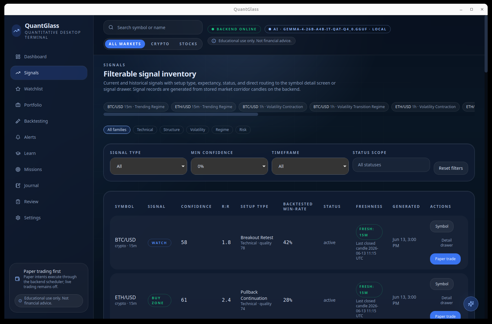
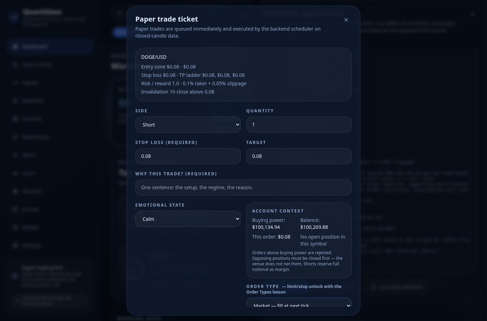
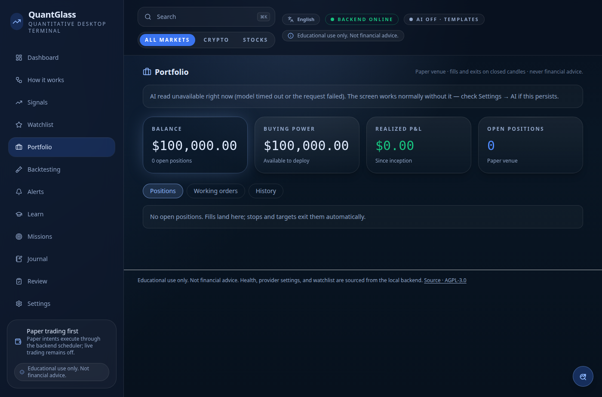
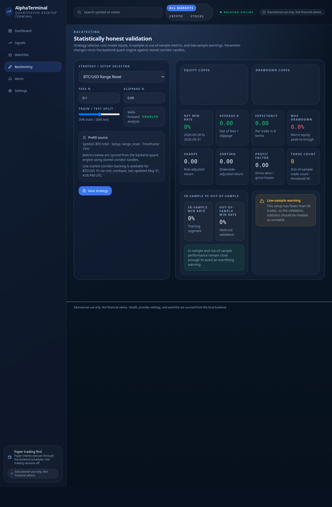
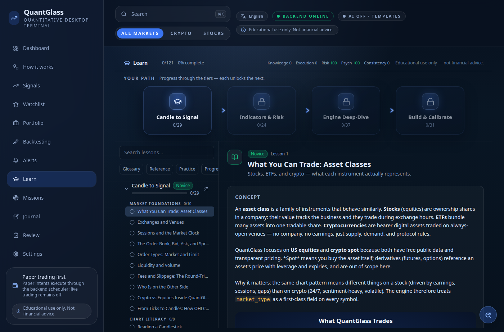
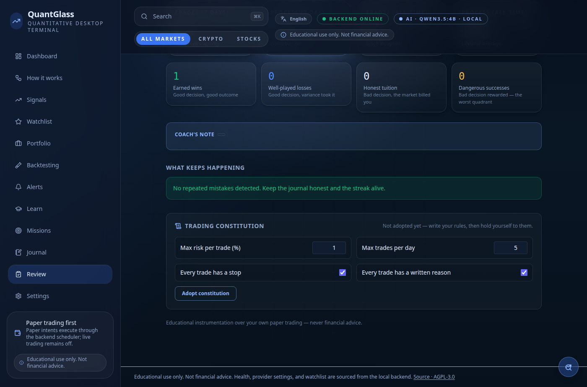
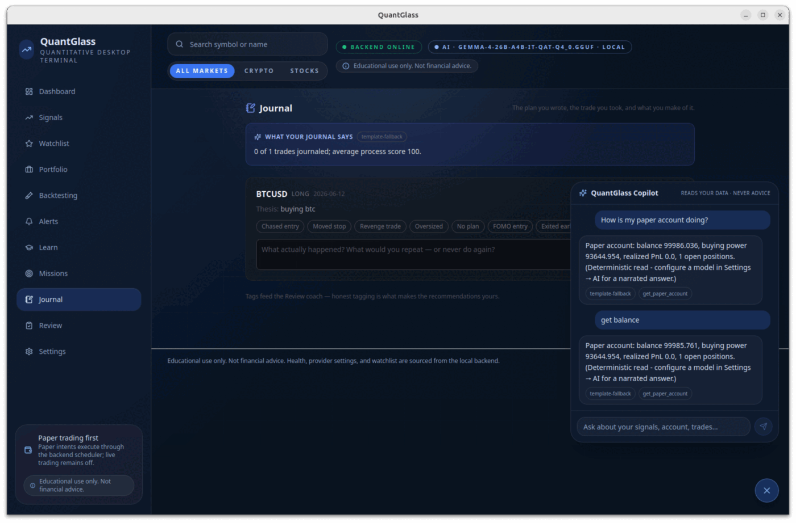

# QuantGlass

[](https://github.com/quantglass-labs/quantglass/actions/workflows/ci.yml)
[](LICENSE)
[](https://github.com/quantglass-labs/quantglass/releases)

QuantGlass is an open-source, local-first trading education and research
workstation for crypto and US equities — a complete trading academy (121
lessons, missions, decision drills) fused with a working quant lab
(evidence-backed signals, statistically honest backtesting, paper trading,
behavioral coaching). Every number the engine shows is one it can defend,
and every concept it teaches can be applied against your own market data.
FastAPI backend, React/Tauri desktop app, typed contracts, extension
registries, and optional local/API AI on a strict fact-guard covenant.

<p align="center">
  
</p>

<p align="center">
  <strong>⬇ Download the app —</strong>
  <a href="https://github.com/quantglass-labs/quantglass/releases/latest"><strong>Windows · macOS · Linux installers (latest release)</strong></a>
</p>

<p align="center"><em>No Python or Node needed — grab the installer for your OS and run it. <a href="#install-for-traders--no-developer-setup">Install &amp; checksum guide ↓</a></em></p>

<p align="center"><em>A guided tour is below — <a href="#screenshots--a-guided-tour">jump to screenshots</a>.</em></p>

QuantGlass is licensed under **AGPL-3.0-or-later**. The community edition is
free to use, study, modify, and redistribute under the AGPL. Commercial licenses
are available for proprietary embedding, closed-source redistribution,
enterprise deployments, hosted offerings, and support arrangements where AGPL
compliance is not a fit.

QuantGlass is not financial advice. It is research and decision-support
software. See [DISCLAIMER.md](DISCLAIMER.md).

## Public Preview Status

QuantGlass is suitable for **community preview, local research, paper trading,
and extension development**. It is not yet a production trading product.

Current working surface:

- **QuantGlass Academy**: 121 lessons across 23 tracks (novice → expert)
  with exams, live exercises on your own market data, interactive visuals,
  spaced-repetition practice, glossary/reference library, progress
  analytics, and local completion certificates. The full lesson catalog and
  interface are **available in 20 languages** (including right-to-left Arabic,
  Persian, Urdu, and Sindhi) — switch language from the header at any time.
- **Missions**: a 108-mission behavioral catalog with interactive decision
  drills (scored on Process / Risk / Discipline), replay missions over
  stylized market episodes, and an unlock ladder gated by conduct.
- **The feedback loop**: plan-aware paper ticket → process scores and the
  decision-vs-outcome 2×2 → Journal (notes, mistake tags) → Review (weekly
  coach, repeated-mistake detection with lesson/mission prescriptions) →
  a user-authored Trading Constitution enforced at the ticket.
- **Signal engine v3**: 32 setup types across 10 taxonomy families with
  evidence-backed confidence (pooled backtests, empirical-Bayes shrinkage,
  conformal intervals, calibration tracking), context signals (regimes,
  volatility, relative strength, macro proxies, event watches), and
  portfolio/risk meta-signals wired to the constitution.
- **Backtesting workbench**: honest train/test splits, cost-stress
  scenarios, Monte Carlo drawdowns, bias/quality gates, experiment
  fingerprints, an AI research review, and a strategy composer constrained
  to data the corridor actually stores.
- **Paper venue at platform parity**: market/limit/stop entries, Day/GTC/GTD
  time in force, trailing stops, live OCO brackets from the trade plan,
  cancel, partial close, account guards, and a closure ledger with
  R-multiples — all on honest closed-candle fills, managed from a dedicated
  Portfolio screen. A live-mode mapping of the same ticket onto broker APIs
  (Alpaca reference mapping) is *designed* to refuse what a broker cannot
  express rather than silently downgrade — but built-in live broker execution
  is **not enabled in the public preview**; paper trading is the supported
  execution path (see Known limitations below).
- **AI on every screen, all on the narration covenant**: local or API models
  (Ollama, LM Studio, OpenAI-compatible, Anthropic, Gemini, Azure, Bedrock)
  narrate engine facts behind a numeric fact guard — signal narration, an AI
  daily brief, natural-language alert creation, per-screen insights, drill
  and trade postmortems, backtest review, weekly coaching, a lesson tutor,
  and the **QuantGlass Copilot** (grounded Q&A over read-only engine tools)
  — with deterministic template fallback when no model is configured.
- **MCP server**: the same read-only tools are exposed over the Model
  Context Protocol, so Claude Desktop/Code or any MCP client can use the
  local engine as a grounded market-facts source.
- Local desktop UI with a loopback-only backend sidecar; public crypto and
  US equity market data defaults; multi-timeframe corridor with Parquet
  archive and behavioral dataset export.
- Extension registries for providers, AI gateways, strategies, indicators,
  lesson packs, mission packs, notifications, and more — with local
  automated review and trust labels.

Known limitations:

- Built-in live broker execution is not available in the public preview.
- Trade-capable keys use the OS keychain only when a usable keychain exists;
  otherwise they fall back to the encrypted local secret file.
- Installers are unsigned unless produced by a maintainer release environment.
- Provider availability depends on third-party public/keyed APIs and their rate
  limits.
- Extension APIs are intentionally early and may change before a stable plugin
  ABI is declared.

## Screenshots — a guided tour

### Dashboard — your cross-market command center

Market regime, the live signal inventory, watchlist momentum, and paper-account
exposure at a glance — topped by an AI daily brief narrated from the engine's own
reads.

<p align="center"></p>

### Signals — evidence, not hype

A filterable inventory of deterministic setups, each with **calibrated**
confidence (backtested, shrinkage-adjusted), an entry/stop/target plan, and data
freshness. Sortable by type, confidence, and timeframe.

<p align="center"></p>

### Paper trading — every trade starts with a plan

The ticket requires a stop, target, risk %, a written reason, and your emotional
state. Market / limit / stop orders, time-in-force, trailing stops, and OCO
brackets — all on honest closed-candle fills.

<p align="center"></p>

### Portfolio — positions, orders, and an honest ledger

Open positions with full and partial close, working orders you can cancel, and a
permanent closure ledger recording every exit with P&L and **R-multiples**.

<p align="center"></p>

### Backtesting — statistically honest validation

Train/test splits, cost-stress scenarios, Monte Carlo drawdown distributions, and
bias/quality gates that are **printed, not hidden** — built to expose overfitting
rather than flatter it.

<p align="center"></p>

### The Academy — learn on your own market data

121 lessons across four levels, decision drills, and behavioral missions that
grade your **process**, not luck — with live exercises against real corridor data.

<p align="center"></p>

### Trading constitution — your rules, enforced

Adopt your own rules (max risk per trade, no averaging down, …). They're checked
at the ticket and block any trade that violates them, before it's placed.

<p align="center"></p>

### AI Copilot — grounded in your own data

Ask about your signals, account, and trades. The model proposes read-only tools,
the engine runs them, and the model narrates only those results behind a numeric
fact-guard — so it **cannot invent a number**. Source-labeled on every answer.

<p align="center"></p>

## Install (for traders — no developer setup)

QuantGlass ships as a normal desktop app. **You do not need Python, Node, or any
developer tools** — download the installer for your operating system from the
**[latest release](https://github.com/quantglass-labs/quantglass/releases/latest)**
(or browse [all releases](https://github.com/quantglass-labs/quantglass/releases))
and run it. The Python engine is bundled inside the app.

On the latest-release page, the installers are under **Assets** — expand it and
pick the file for your OS from the table below.

| OS          | Download                                                             | Notes                                                                                                                                      |
| ----------- | -------------------------------------------------------------------- | ------------------------------------------------------------------------------------------------------------------------------------------ |
| **Windows** | `.exe` (installer) or `.msi`                                         | On first launch Windows SmartScreen may say "unknown publisher" — click **More info → Run anyway**.                                        |
| **macOS**   | `.dmg`                                                               | Drag to Applications. The build is unsigned, so the first time **right-click the app → Open** (don't double-click) to get past Gatekeeper. |
| **Linux**   | `.AppImage` (portable — just `chmod +x` and run), or `.deb` / `.rpm` | The AppImage needs no installation.                                                                                                        |

> **Why the security warnings?** The community builds are **not code-signed**
> (signing requires paid Apple/Microsoft certificates). The steps above are the
> one-time bypass. Because the builds are unsigned, **verify the checksum** so
> you know the download is intact and unmodified.

### Verify your download

Each release ships a per-OS `SHA256SUMS` file. Download it next to your
installer, then compare. The printed hash must match the line for your file.

```powershell
# Windows (PowerShell) — compare the output to SHA256SUMS-Windows.txt
Get-FileHash .\QuantGlass_*_x64-setup.exe -Algorithm SHA256
```

```bash
# macOS — verifies every file listed in the sums file
shasum -a 256 -c SHA256SUMS-macOS.txt

# Linux
sha256sum -c SHA256SUMS-Linux.txt
```

Prefer to self-host the engine and use it from a browser (e.g. on a home server)?
See [Run with Docker](#run-with-docker-self-host--server-mode).

## Why Contributors Might Care

QuantGlass is built around extension points that are useful to market-data,
quant, desktop, and local-AI contributors:

- Provider adapters for market data, news, brokers, and alert channels.
- Deterministic indicators and regime features.
- Signal families and statistically honest backtests.
- Local/API model narration through Ollama, LM Studio, OpenAI, or any
  OpenAI-compatible gateway, with fact guards.
- Desktop workflows for watchlists, signals, alerts, paper trading, and
  settings.
- Packaging for a local desktop app with a managed backend sidecar.

## Repository Layout

```text
apps/
  backend/        FastAPI service, scheduler, storage, providers, signals
  desktop/        React + Tauri desktop application
packages/
  contracts/      Shared TypeScript API contracts
  quantglass-sdk/ Standalone extension SDK (mirrored to quantglass-labs/quantglass-sdk)
docs/
  technical/      Architecture and implementation docs
  user-guide/     End-user documentation
  contributing/   Extension and testing guides
```

Extensions are developed in two dedicated repos under
[QuantGlass Labs](https://github.com/quantglass-labs): the authoring SDK
[`quantglass-sdk`](https://github.com/quantglass-labs/quantglass-sdk) and
community templates + content packs
[`quantglass-extensions`](https://github.com/quantglass-labs/quantglass-extensions).

## Licensing And Commercial Use

- Community license: [AGPL-3.0-or-later](LICENSE).
- Commercial options: [COMMERCIAL-LICENSE.md](COMMERCIAL-LICENSE.md).
- AGPL release checklist: [AGPL-COMPLIANCE.md](AGPL-COMPLIANCE.md).
- Third-party notices: [THIRD-PARTY-NOTICES.md](THIRD-PARTY-NOTICES.md).
- Contributor terms: [CLA.md](CLA.md).
- Trademark guidance: [TRADEMARKS.md](TRADEMARKS.md).

The practical model is open-source core plus paid commercial options:

- Individuals, researchers, educators, and open-source users can use the AGPL
  edition.
- Companies that need proprietary redistribution, private hosted products,
  closed-source forks, or enterprise support can buy a commercial license.

## Build from source (developers)

> Most users do not need this — see [Install (for traders)](#install-for-traders--no-developer-setup)
> above. This section is for building QuantGlass yourself. Requires Python 3.12+,
> Node 22+, and the Rust toolchain.

Install backend dependencies:

```bash
python -m venv .venv
# The extension SDK is a local package the backend depends on; install it first.
./.venv/bin/python -m pip install -e packages/quantglass-sdk
./.venv/bin/python -m pip install -e "apps/backend[dev,package]"
```

Install desktop dependencies:

```bash
npm --prefix apps/desktop ci
```

Run backend validation:

```bash
npm run validate:backend
```

Run the backend in development:

```bash
npm run backend:dev
```

Run the backend with trusted local/installed extensions enabled:

```bash
npm run backend:dev:extensions
```

Run the desktop build:

```bash
npm run desktop:build
```

Run the desktop in development:

```bash
npm run desktop:dev
```

Run Tauri development:

```bash
npm run desktop:tauri:dev
```

Build the backend sidecar and desktop packages:

```bash
npm run backend:bundle
npm run desktop:tauri:build
```

## Run with Docker (self-host / server mode)

If you'd rather run the engine always-on (a home server or VPS) and use it from
a browser, one container serves the web UI and the API on a single port. You
need only Docker — no Python, Node, or Rust.

```bash
docker compose up --build
```

Then open **`http://localhost:8000`**. Your data persists in the `quantglass-data`
named volume across restarts.

By default the port is published to **host loopback only** (`127.0.0.1:8000`), so
the instance is reachable from your own browser but **not** from other machines
on your network.

Or build and run the image directly (note the explicit loopback bind):

```bash
docker build -t quantglass .
docker run -p 127.0.0.1:8000:8000 -v quantglass-data:/data quantglass
```

### Exposing it beyond localhost

To reach it from a home server or VPS, you must do **both**:

1. Publish on all interfaces — `docker run -p 8000:8000 …`, or set
   `ports: ["8000:8000"]` in `docker-compose.yml`.
2. **Set an access token** so the instance isn't open to the network:

   ```bash
   docker run -p 8000:8000 -e QUANTGLASS_SERVER_AUTH_TOKEN="$(openssl rand -hex 24)" \
     -v quantglass-data:/data quantglass
   ```

   With a token set, every request needs it — browsers get a sign-in page; API
   clients send `Authorization: Bearer <token>`. Without a token, exposing
   port 8000 leaves your local data, watchlists, and paper account open to
   anyone who can reach it. Put it behind HTTPS (a reverse proxy) for real use.

Notes:

- This is a convenience for self-hosters; the **desktop installers remain the
  primary distribution** for most users.
- Inside the container the process binds `0.0.0.0` (required for Docker port
  mapping); network exposure is governed by the publish bind and the auth token
  above, not by that in-container bind.
- **AGPL §13:** because this serves the program over a network, the running
  instance offers its Corresponding Source at **`/source`** (also linked from the
  app footer). If you run a modified version, you must offer your modified source.
- Paper trading is the supported execution path. Educational and research
  software, not financial advice — see [DISCLAIMER.md](DISCLAIMER.md).

## Common Commands

```bash
npm run backend:test
npm run backend:check
npm run backend:openapi
npm run desktop:build
npm run desktop:tauri:build
npm run validate:backend
npm run validate:release
```

## Contribution Guides

- [Contributing](CONTRIBUTING.md)
- [Good first contribution ideas](docs/contributing/good-first-issues.md)
- [Provider adapters](docs/contributing/provider-adapters.md)
- [Extension system](docs/contributing/extensions.md)
- [Extension types](docs/contributing/extension-types.md)
- [AI model gateways](docs/contributing/ai-model-gateways.md)
- [Strategy contributions](docs/contributing/strategy-plugins.md)
- [Indicator contract](docs/contributing/indicator-contract.md)
- [Testing guide](docs/contributing/testing.md)
- [Roadmap](ROADMAP.md)
- [Governance](GOVERNANCE.md)
- [Security policy](SECURITY.md)

## Project Status

QuantGlass is a young project. It has a working local backend, desktop surface,
release build path, AGPL/commercial licensing docs, and contributor extension
plumbing. Treat it as an alpha/beta research tool until CI, signed packaging,
keychain enforcement for trade-capable keys, and live-trading safety gates
mature.

Paper trading is the supported execution path. Built-in live trading remains
unavailable in the public preview.

## Documentation

- [Technical docs](docs/technical/README.md)
- [User guide](docs/user-guide/README.md)
- [Configuration reference](docs/configuration.md)
- [Changelog](CHANGELOG.md)
