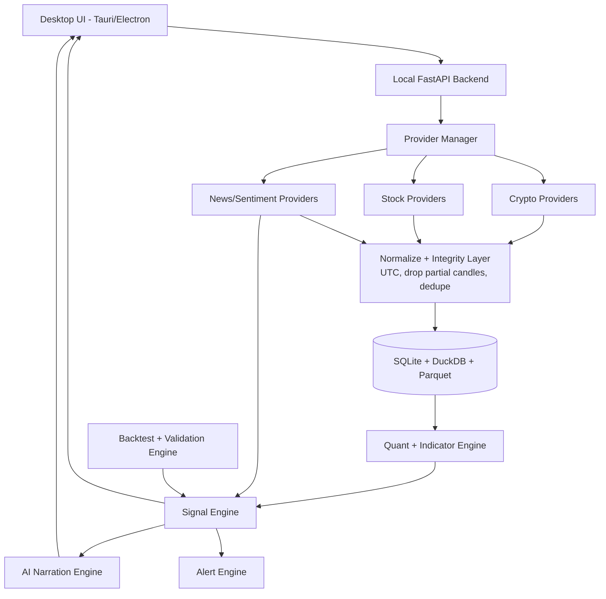
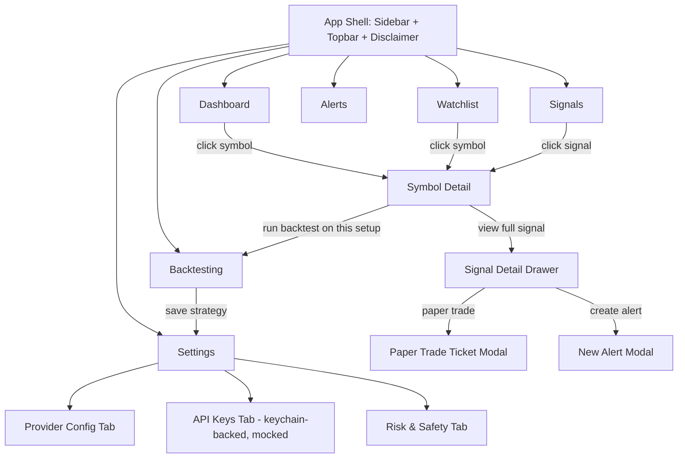

# Single-User AI Trade-Signal & Market-Research Application

## Direction: Modern Local-First Decision-Support App with a Cost-Effective Data Strategy

> **Important framing / disclaimer.** This is a **personal, single-user, US-based decision-support and research tool** for **US-listed stocks/ETFs and crypto available to US persons**. It is not a financial-advisory product, not a registered investment adviser (RIA) service, and not an automated trading system in v1. It does not provide financial advice (no US securities/investment-adviser regulatory posture is claimed or implied). All signals are educational analysis of historical and current market data and may be wrong. The user is solely responsible for any trade. Any live-trading capability is opt-in, off by default, and gated behind paper-trading validation. This framing should appear in the app UI (an "Educational use only — not financial advice" notice) and in any export.

This document refines the architecture for a **single-user, single-machine** trading research and signal application running locally on Windows or macOS. The goal is not an enterprise platform. The goal is a private, practical, low-cost desktop assistant that helps one investor analyze crypto and stocks using modern market data, technical indicators, AI-narrated explanations, statistically honest backtesting, alerts, and optional paper/live trading integrations.

The application supports multiple data providers through adapters but ships with a **recommended default stack** so the user is not forced to evaluate ten services on day one.

---

## 1. Final Product Vision

Build a local desktop application that behaves like a disciplined personal trading analyst:

- Pulls market candles, quotes, volume, news, and optional sentiment/on-chain data.
- Analyzes crypto and stock charts using indicators, chart patterns, trend structure, volatility, support/resistance, and market regime.
- Generates Buy / Sell / Hold / Wait / Watch signals.
- Provides entry zone, stop loss, take-profit levels, risk level, an **evidence-based** confidence score, and an explicit invalidation condition.
- Explains every signal in plain English, **strictly narrating the facts the deterministic engine already produced** (no invented reasoning).
- Stores market data and signal history locally and reproducibly.
- Backtests strategies — with fees, slippage, and out-of-sample validation — before trusting them.
- Sends alerts to desktop, Telegram, email, or mobile push.
- Optionally connects to **paper trading first**, and only later to live broker/exchange APIs behind explicit, secured opt-in.

The system **does not auto-trade in v1.** It is a decision-support system first.

---

## 2. Modernity & Soundness Principles (as of May 2026)

1. **Local-first desktop**: Tauri (preferred) or Electron UI, local backend, local database.
2. **Provider adapter pattern**: avoid lock-in; capability-segregated interfaces (see §6).
3. **Hybrid data approach**: direct exchange APIs for crypto, market-data APIs for stocks, paid data only when a real limit is hit.
4. **Deterministic quant engine is the source of truth**: indicators, patterns, risk, backtests.
5. **AI is a narration/research layer only**: it explains and compares; it never originates the numeric signal and never adds reasons the engine didn't compute.
6. **Signal confidence must be evidence-based and traceable** to trend, volume, volatility, **realized backtest expectancy of the setup type**, news, and risk/reward.
7. **Backtesting must model fees, slippage, and use out-of-sample / walk-forward validation** — otherwise results are noise.
8. **Data integrity discipline**: all timestamps normalized to UTC; partial (still-forming) candles excluded from signal logic.
9. **Paper trading before live trading**, always.
10. **Secrets are stored in the OS keychain**, never plaintext, especially trade-enabled keys.
11. **Cost-controlled provider strategy**: start free/low-cost, upgrade only when a limitation actually bites.
12. **Regional reality check**: verify that the chosen exchanges/providers are accessible and lawful in the user's jurisdiction before defaulting to them.

---

## 3. Recommended Default Provider Stack

### 3.1 Best Default Stack

For a single-user app, do not start with 10 providers. Start with this:

| Area | Recommended Default | Why / Caveat |
|---|---|---|
| Crypto exchange candles & live prices | CCXT + a US-compliant exchange (Coinbase, Kraken, Gemini; Binance.**US** only — never Binance.com global) | Best for exchange-native OHLCV, order books, and future trading. For US persons default to **Coinbase or Kraken** (deep US support, good CCXT coverage). Avoid Binance.com global (not for US persons). |
| Broad crypto market metadata | CoinGecko Demo API | Good for coin metadata, categories, discovery. **Heavily rate-limited (~30 calls/min, monthly cap)** — rely on aggressive caching, not frequent polling. |
| Stock/ETF market data | Finnhub Free or Alpaca Basic | Practical for single-user research. Alpaca if paper trading matters; Finnhub for fundamentals/news/sentiment. Both have free-tier limits and delayed data. |
| Technical indicators | Local: `pandas-ta` (primary), `ta`, optional TA-Lib | Compute locally. **Avoid TA-Lib as the default** — its C dependency breaks plain `pip install` on Windows. Make it optional. |
| Chart UI | TradingView Lightweight Charts | Free/open-source, fast, professional. (Check the current license terms before redistribution.) |
| Backtesting | `vectorbt` (open-source) or `backtesting.py` | Fast local research. **Note:** OSS vectorbt is largely frozen; active work is in paid vectorbt PRO. `backtesting.py`/`backtrader` are maintained alternatives. |
| AI explanation | Local Ollama first; optional cloud LLM | Low cost, high privacy. Cloud LLM only for deep reports. |
| Alerts | Telegram Bot API + desktop notifications | Simple, cheap, reliable. |
| Local storage | SQLite (app state) + DuckDB (analytics) + Parquet (long-term candles) | SQLite for state; DuckDB for backtests/analytics. |

### 3.2 Why Not Just One Provider?

Support multiple providers; activate one or two by default. Reasons: crypto and stock data are different markets; one provider rarely covers both well; free tiers lack historical depth; rate limits can break signal generation if everything depends on one API; exchange-native crypto data is more accurate for trading than aggregated prices; and some providers don't serve your region/broker/exchange.

Correct architecture:

> One default provider stack + capability-based adapter system + fallback providers.

### 3.3 US Compliance & Access Notes (this build targets US persons)

- **Crypto exchanges:** default to **Coinbase Advanced Trade** or **Kraken** for US persons. Gemini and Binance.US are acceptable alternates. **Do not default to Binance.com global, OKX, or Bybit** for US-resident live trading — they are not intended for US persons. CCXT supports `coinbase`, `kraken`, `gemini`, and `binanceus` endpoints; pick the US-appropriate one explicitly in config.
- **Equities/ETFs:** **Alpaca** is the natural US default — US broker-dealer, free IEX-sourced market data on the basic tier, native paper trading, and a clean trading API. This makes Alpaca the recommended single integration for both stock data *and* paper/live equity trading in a US build.
- **Market-data licensing:** US equity data has redistribution/display restrictions. For a single-user local app this is generally fine (personal, non-display, non-redistributed use), but if you ever expose data beyond yourself, confirm the provider's license. Free tiers are typically IEX or 15-minute-delayed; real-time consolidated (SIP) data costs more and carries exchange fees.
- **No RIA/BD posture:** the app must not be marketed or worded as giving investment advice or managing money for others. Keep it single-user and educational (see disclaimer).
- **Tax/record note (optional later):** US users may want CSV/trade-journal export structured for cost-basis tracking; keep this in mind for the journal feature, not the MVP.

---

## 4. Recommended Provider Selection by Stage

### Stage 1 — Free / Almost-Free MVP

| Need | Provider | Approx. Cost | Notes |
|---|---|---:|---|
| Crypto OHLCV & exchange data | CCXT + Coinbase or Kraken (US) | $0 | US-compliant default; native OHLCV + order book. |
| Crypto metadata / broad market | CoinGecko Demo API | $0 | Cache hard; free tier is tightly rate-limited. |
| Stock data | Alpaca Basic (US) or Finnhub Free | $0 | Alpaca preferred for US: free IEX data + native paper trading. |
| Indicators | Local `pandas-ta` / `ta` (TA-Lib optional) | $0 | Compute locally. |
| Charts | TradingView Lightweight Charts | $0 | Check license. |
| AI | Ollama local models | $0 API | Hardware cost only. |
| Alerts | Telegram Bot API | $0 | — |

Estimated monthly cost: **$0–$10**, excluding optional cloud-LLM usage.

### Stage 2 — Serious Personal Trading Setup

| Need | Provider | Approx. Cost | Notes |
|---|---|---:|---|
| Crypto market data | CoinGecko paid or CoinMarketCap paid tier | ~$29–$129/mo | Upgrade only if rate limits/history bite. |
| Stock/ETF data | Alpaca paid data, Twelve Data, or Finnhub paid | ~$49–$129/mo (verify current pricing) | Choose by whether trading integration or breadth matters. |
| AI deep analysis | OpenAI / Anthropic / Gemini API | Usage-based | Selected deep reports only, never per-candle. |
| News/sentiment | Finnhub paid or other news API | Free→paid | For news-sensitive equity signals. |

Estimated monthly cost: **$50–$250** depending on stock data and AI usage.
*(All prices are indicative; confirm current rates before committing.)*

### Stage 3 — Advanced / Semi-Professional Personal System

| Need | Provider | Approx. Cost | Notes |
|---|---|---:|---|
| Higher-grade stock data | Polygon, Twelve Data Pro, Finnhub/Alpaca premium | ~$199+/mo possible | Only if intraday equity signals matter. |
| Options data | Broker/provider-specific | Variable | Avoid in MVP. |
| On-chain analytics | Glassnode, CryptoQuant, Santiment, Token Terminal, Dune | Free→expensive | Macro crypto conviction, not basic chart signals. |
| Live trading | Alpaca, IBKR, or your chosen exchange | Broker/exchange-dependent | Paper trading first; secured keys (§5.2). |

Estimated monthly cost: **$200–$1,000+** with premium real-time/intraday data.

---

## 5. Recommended Final Choice for This Case

### 5.1 Providers

**Crypto (US persons)**
1. Primary: CCXT with **Coinbase Advanced Trade** or **Kraken** (US-compliant).
2. Secondary: CoinGecko Demo API for broad metadata/historical context (cached).
3. Optional later: CoinMarketCap for rankings/watchlists; Gemini or Binance.US as alternate exchanges.

**Stocks & ETFs (US-listed)**
1. MVP primary: **Alpaca Basic** (US broker, free IEX data, native paper trading) — recommended single integration for data + execution.
2. Alternate/secondary data: Finnhub Free (adds fundamentals/news/sentiment).
3. If clean multi-asset history matters: add Twelve Data as secondary.
4. If serious intraday/real-time SIP later: consider Polygon or Alpaca premium (note exchange data fees).

**Indicators** — compute locally: `pandas-ta` (primary), `ta`, NumPy/pandas, custom pattern detection. TA-Lib optional (document the C-library install).

**AI** — Ollama by default (Qwen/Llama/Mistral/Gemma sized to your machine). Cloud LLM only for deep research, strategy review, or weekly summaries.

### 5.2 Secrets & Key Handling (mandatory before any live trading)

- Read-only data keys: may live in encrypted local config.
- **Trade-enabled keys: stored only in the OS keychain** (Windows Credential Manager / macOS Keychain), never in SQLite, never plaintext, never logged.
- Trading scope on keys should be minimized; withdrawals disabled where the exchange allows scoping.

---

## 6. Provider Adapter Architecture

Adapters let providers be swapped without rewriting the signal engine. Interfaces are **capability-segregated** so a provider only implements what it actually supports (CoinGecko has no order book; most free stock tiers have no order book; news is a separate concern).



### Capability-Segregated Provider Interfaces

```python
from typing import Protocol, Optional

class OHLCVProvider(Protocol):
    def get_symbols(self, market_type: str) -> list[str]: ...
    def get_ohlcv(self, symbol: str, timeframe: str,
                  start=None, end=None) -> "pd.DataFrame": ...
    def get_quote(self, symbol: str) -> dict: ...

class OrderBookProvider(Protocol):      # only exchanges implement this
    def get_order_book(self, symbol: str, depth: int = 50) -> dict: ...

class NewsProvider(Protocol):           # news/sentiment sources only
    def get_news(self, symbol: str, limit: int = 20) -> list[dict]: ...

class TradingProvider(Protocol):        # paper/live execution only
    def submit_order(self, order: dict) -> dict: ...
    def get_positions(self) -> list[dict]: ...
    def cancel_order(self, order_id: str) -> dict: ...
```

A provider declares the capabilities it supports; the Provider Manager routes requests only to providers that implement the needed capability, with a configured fallback chain.

```text
providers/
  crypto/   ccxt_provider.py  coingecko_provider.py  coinmarketcap_provider.py
  stocks/   alpaca_provider.py  finnhub_provider.py  twelvedata_provider.py  polygon_provider.py
  news/     finnhub_news_provider.py  newsapi_provider.py
  ai/       ollama_provider.py  openai_provider.py  anthropic_provider.py  gemini_provider.py
  trading/  alpaca_paper_provider.py  ccxt_trade_provider.py
```

---

## 7. Cost-Control & Data-Integrity Rules

**Cost control**
1. Cache all candles locally; never refetch existing OHLCV.
2. Update only the latest candles incrementally.
3. Run expensive AI only on final signal *candidates*, never per symbol per candle.
4. Avoid paid indicator APIs in v1.
5. Avoid real-time tick data unless a strategy truly needs it.
6. Start with 15m / 1h / 4h / 1d candles, not second-by-second data.
7. Limit watchlist size in the MVP.
8. Prefer daily/4h swing signals first (cheaper data than intraday HFT-style signals).
9. Add paid providers only after **out-of-sample** backtests show value.

**Data integrity (prevents false signals)**
10. Normalize all timestamps to UTC on ingest; store the source timezone.
11. **Exclude the still-forming (partial) latest candle** from signal logic; only act on closed candles.
12. Deduplicate and gap-check candles; flag and backfill missing bars before computing indicators.
13. Treat provider data as untrusted: validate ranges (no negative volume, no zero/`NaN` OHLC) before it reaches the quant engine.

---

## 8. Signal Generation Pipeline

```mermaid
flowchart LR
    A[Fetch Closed Candles] --> B[Clean / Normalize / Integrity Check]
    B --> C[Calculate Indicators]
    C --> D[Detect Patterns]
    D --> E[Support / Resistance]
    E --> F[Market Regime]
    F --> G[Risk Engine]
    G --> H[Lookup Backtested Expectancy for Setup Type]
    H --> I[Signal Score]
    I --> J[AI Narration of Engine Facts]
    J --> K[Alert / Dashboard]
```



### Signal Output Format

The confidence score and risk/reward are **derived from and traceable to** the deterministic engine and the backtested statistics of the matched setup type — not a free-floating number.

```json
{
  "symbol": "BTC/USDT",
  "timeframe": "4h",
  "signal": "BUY_ZONE",
  "risk_level": "medium",
  "confidence": 72,
  "confidence_basis": {
    "trend_alignment": 0.8,
    "volume_confirmation": 0.7,
    "volatility_regime": "normal",
    "setup_type": "ema_reclaim_pullback",
    "backtested_winrate": 0.58,
    "backtested_expectancy_R": 0.34,
    "backtest_sample_size": 146,
    "out_of_sample_validated": true
  },
  "entry_zone": [68000, 69200],
  "stop_loss": 65800,
  "take_profit": [71500, 74200, 78000],
  "risk_reward": 2.4,
  "fees_slippage_assumed": "0.1% taker + 0.05% slippage",
  "reasons": [
    "Price reclaimed 50 EMA on the closed 4h candle",
    "RSI recovered from oversold",
    "Volume increased on the breakout candle",
    "Support confirmed near prior demand zone"
  ],
  "invalidation": "4h close below 65800",
  "candle_status": "closed",
  "data_source": "ccxt:binance",
  "generated_at_utc": "2026-05-29T12:00:00Z",
  "ai_explanation": "BTC entered a medium-risk buy zone after reclaiming short-term trend support on the closed candle. This setup type has a 58% historical win rate over 146 samples (out-of-sample validated). Confirmation improves if price holds above the breakout level next candle.",
  "disclaimer": "Educational analysis only. Not financial advice."
}
```

---

## 9. Backtesting & Validation (the part that decides if any of this is real)

A backtest that ignores costs and uses only in-sample data will make almost anything look profitable. This section is mandatory, not optional.

- **Model real costs:** exchange/broker fees + realistic slippage on every fill. Report metrics both gross and net.
- **Out-of-sample first:** split history into train and held-out test; never tune on the test set.
- **Walk-forward analysis:** re-optimize on a rolling window and validate forward, to detect overfitting and regime sensitivity.
- **Avoid lookahead bias:** indicators and decisions on bar *t* may use only data available at the close of bar *t*; never future bars.
- **Survivorship bias (stocks/crypto):** include delisted symbols where possible; be explicit when you can't.
- **Sample-size sanity:** a setup with <30–50 trades is not statistically meaningful; flag low-sample signals as low-confidence.
- **Report:** win rate, average R, expectancy, max drawdown, Sharpe/Sortino, profit factor, trade count, and the test period.
- **Tie signals to stats:** the live signal score references the *same setup type's* validated expectancy (see §8).

---

## 10. AI Narration Constraints (anti-hallucination)

- The LLM receives a **structured object of facts already computed by the deterministic engine** and is instructed to *narrate only those facts*.
- The LLM **must not** invent indicator readings, add new "reasons," compute levels, or contradict the engine. If a field is absent, it is not mentioned.
- Prefer constrained/JSON-guided output and validate the narration doesn't introduce numbers not present in the input.
- Cloud LLMs are used only for periodic deep reports/weekly reviews, never in the per-signal hot path by default.

---

## 11. Recommended Technology Stack

**Desktop App** — Tauri + React + TypeScript preferred (lighter); Electron acceptable for faster iteration.

**Local Backend** — Python FastAPI; APScheduler for periodic updates; WebSocket to UI for live updates.

**Storage** — SQLite (settings, watchlists, providers, signals, alerts, strategy defs); DuckDB (OHLCV analytics, backtest snapshots); Parquet (long-term candle archive).

**Quant & Indicators** — pandas, NumPy, `pandas-ta` (primary), `ta`, optional TA-Lib; `vectorbt` or `backtesting.py`; scikit-learn for optional ML classifiers (kept out of the v1 critical path).

**AI Layer** — Ollama local server; optional OpenAI/Anthropic/Gemini adapters; prompt templates for signal narration, risk explanation, weekly review, trade-journal feedback — all under §10 constraints.

**Charting** — TradingView Lightweight Charts; custom overlays for indicators, zones, SL/TP, signal markers.

**Alerts** — Desktop notifications; Telegram Bot API; optional email SMTP; optional push later.

**Security** — OS keychain for secrets; encrypted local config for non-trade keys.

---

## 12. Third-Party Integrations

**Must-Have for MVP:** CCXT · CoinGecko · Finnhub or Alpaca · TradingView Lightweight Charts · Ollama · Telegram Bot API.

**Good Later:** CoinMarketCap · Twelve Data · Polygon · Interactive Brokers · authenticated exchange trading APIs (Binance/Coinbase/Kraken/OKX/Bybit, region-permitting) · NewsAPI/Benzinga-style feed · Dune/Glassnode/CryptoQuant/Santiment · Notion/Obsidian/CSV trade-journal export.

---

## 13. UI Architecture Decision

Support many providers internally; keep the UI simple.

- **Simple Mode:** Crypto Provider = Auto · Stock Provider = Auto · AI = Local Ollama · Trading = Disabled/Paper only · prominent "educational, not advice" notice.
- **Advanced Mode:** provider priority, API keys (routed to keychain for trade keys), fallback selection, rate-limit config, and a toggle for whether paid APIs are allowed.

```yaml
crypto:
  primary: ccxt_coinbase      # US-compliant; or ccxt_kraken
  secondary: coingecko
  fallback: ccxt_kraken

stocks:
  primary: alpaca             # US broker; free IEX data + paper trading
  secondary: finnhub
  fallback: twelvedata

ai:
  primary: ollama
  secondary: openai
  fallback: none

safety:
  trading_mode: paper        # paper | live (live requires explicit confirm + keychain keys)
  act_on_partial_candles: false
  min_backtest_sample: 50
```

---

## 14. MVP Build Order

**Phase 1 — Skeleton:** Tauri/Electron app, FastAPI backend, SQLite/DuckDB, watchlist, provider settings, disclaimer notice.

**Phase 2 — Market Data:** CCXT crypto candles, CoinGecko metadata, Finnhub/Alpaca stock candles/quotes, normalization + integrity layer, local caching.

**Phase 3 — Charts & Indicators:** Lightweight Charts; EMA/SMA/RSI/MACD/Bollinger/ATR/Volume; support/resistance zones.

**Phase 4 — Signal Engine:** Buy/Sell/Hold/Wait logic, risk/reward model, signal score, SL/TP, closed-candle-only rule.

**Phase 5 — Backtesting & Validation:** vectorbt/`backtesting.py`; fees + slippage; out-of-sample + walk-forward; win rate/drawdown/Sharpe/profit factor. *(Done before trusting Phase 4 output — consider running Phase 5 in parallel with Phase 4.)*

**Phase 6 — AI Narration:** Ollama integration; constrained narration of engine facts; risk and invalidation explanations.

**Phase 7 — Alerts & Paper Trading:** Telegram + desktop alerts; Alpaca paper trading or exchange sandbox; keychain-backed key storage.

> Note: §9 backtesting (Phase 5) gates trust in §8 signals (Phase 4). Build the validation harness early even if it ships alongside, not strictly after, the signal engine.

---

## 15. Recommended Monthly Budget

**Practical Starting Budget**

| Component | Cost |
|---|---:|
| Crypto market data | $0 |
| Stock data | $0 |
| Local AI | $0 API |
| Charts | $0 |
| Indicators/backtesting libs | $0 |
| Alerts | $0 |
| Optional cloud LLM | $5–$30/mo |

Recommended starting budget: **$0–$30/month**.

**Serious Personal Version**

| Component | Cost |
|---|---:|
| Better crypto API | $29–$129/mo |
| Better stock data | $49–$129/mo |
| Cloud AI deep analysis | $10–$100/mo usage-based |
| News/sentiment upgrade | $0–$99/mo |

Recommended serious budget: **$50–$250/month** *(verify current pricing before committing)*.

**Avoid initially:** expensive real-time tick data, enterprise feeds, options data, paid on-chain analytics, paid indicator APIs, fully automated live trading.

---

## 16. Key Principle

The best system for this case is **not** one expensive all-in-one provider. It is:

> Local-first app + cheap default data providers + capability-segregated adapters + local indicator computation + **statistically honest backtesting** + AI that narrates (not invents) + secured secrets + optional paid upgrades only when a real limit is hit.

This delivers flexibility, low cost, and future power — while protecting you from the two failure modes that kill most retail signal systems: **overfit backtests** and **signals nobody can trust because nothing is validated.**

---

# Part II — UI/UX Specification for Agent-Generated Mock

> **Why this part exists.** Part I tells a coding agent (Claude Code, Codex, etc.) *what to build and why*. It is **not enough on its own** to produce a coherent, end-to-end *navigable* mock UI — an agent would have to invent the screen list, the layout of each screen, the navigation graph, and every empty/loading/error state, and those inventions drift apart into pretty-but-disconnected screens. Part II supplies exactly that missing layer: the screen inventory, per-screen contents, the navigation map, mock-data contract, and component states. With Parts I + II together, an agent has enough to generate a clickable, internally consistent prototype.

## 17. Mock Scope & Build Instructions for the Agent

**Goal of the mock:** a fully **navigable, frontend-only** prototype with **no live network calls** — every screen renders from local mock fixtures (§21). All buttons, tabs, and links route to a real screen or a defined empty/disabled state. Nothing is a dead end.

**Tech for the mock:** React + TypeScript + Tailwind, single-page app with client-side routing (e.g., a hash/memory router). Use TradingView Lightweight Charts for charts; if unavailable in the sandbox, fall back to a lightweight candlestick component. **No backend, no API keys, no real data** — import from `/mock` fixtures only. Persist nothing to localStorage (use in-memory state).

**Design language:** dark, modern, glassmorphism-leaning fintech aesthetic — deep neutral background, translucent layered cards with subtle blur and 1px hairline borders, restrained accent palette (one positive/green, one negative/red, one neutral/blue accent), tabular/monospace numerals for all prices and metrics, generous spacing, no clutter. Signals use consistent color semantics (BUY=green, SELL=red, HOLD/WAIT=amber, WATCH=blue). Always show the "Educational use only — not financial advice" notice in the footer/header.

**Build order for the agent:** (1) shell + navigation + routing, (2) Dashboard, (3) Symbol Detail, (4) Signals, (5) Backtesting, (6) Watchlist, (7) Alerts, (8) Settings, (9) wire all empty/loading/error states, (10) wire the "paper-trade / live disabled" gating.

## 18. Information Architecture & Navigation Map

Primary navigation is a **left sidebar** (persistent) on desktop. Top bar holds: global symbol search, market-type toggle (Crypto / Stocks), data-mode badge ("MOCK DATA"), and the disclaimer chip.



Every screen is reachable from the sidebar or from a parent screen; every action above resolves to a real route, modal, or drawer.

## 19. Screen Inventory (each must be built)

For each screen the agent builds: header, primary content, the listed components, and the empty/loading/error variants from §22.

**19.1 Dashboard (`/`)**
- Market overview strip: top movers, market regime badge (e.g., "Risk-On / Trending"), BTC + SPY mini-cards.
- "Latest Signals" feed (cards): symbol, signal type chip, confidence ring, risk/reward, timeframe, timestamp. Click → Symbol Detail.
- "Watchlist Snapshot": compact rows with sparkline, last price, % change, active-signal dot.
- Mini portfolio/paper-account summary card (mock balance, open paper positions count).

**19.2 Symbol Detail (`/symbol/:id`)**
- Large candlestick chart with overlay toggles: EMA/SMA, RSI panel, MACD panel, Bollinger, ATR, volume, support/resistance zones, signal markers (entry/SL/TP drawn on chart).
- Timeframe selector: 15m / 1h / 4h / 1d.
- Right rail: current signal card (full §8 fields), key indicator readouts, recent news list (mock).
- Buttons: "View full signal" (→ Signal Detail drawer), "Run backtest on this setup" (→ Backtesting prefilled), "Add to watchlist", "Create alert".

**19.3 Signals (`/signals`)**
- Filterable/sortable table of all current + historical signals: symbol, market, signal, confidence, R:R, setup type, backtested win-rate, status (active/invalidated/closed), generated-at.
- Filters: market type, signal type, min confidence, timeframe, active-only.
- Row click → Symbol Detail; row action → Signal Detail drawer.

**19.4 Signal Detail (drawer/modal)**
- Full §8 JSON rendered human-readably: entry zone, SL, TP ladder, invalidation, fees/slippage assumed, `confidence_basis` breakdown (trend/volume/volatility + backtested win-rate, expectancy R, sample size, OOS-validated badge), engine reasons list, AI narration block (clearly labeled "AI explanation — narrates engine facts only").
- Actions: "Paper trade this" (→ Paper Trade Ticket), "Create alert", "Copy signal JSON".

**19.5 Backtesting (`/backtest`)**
- Strategy/setup selector + parameter form (indicators, thresholds, timeframe, date range, **fees %, slippage %**, train/test split, walk-forward toggle).
- Run button → results panel: equity curve chart, drawdown chart, and a metrics grid — **net** win rate, avg R, expectancy, max drawdown, Sharpe/Sortino, profit factor, trade count, test period, and an **out-of-sample vs in-sample** comparison. Low-sample (<50 trades) shows a visible warning badge.
- "Save strategy" → persists (mock) and appears in Settings.

**19.6 Watchlist (`/watchlist`)**
- Add-symbol search; grouped Crypto / Stocks lists. Rows: symbol, last, % change, sparkline, active signal chip, alert bell, remove. Click → Symbol Detail.

**19.7 Alerts (`/alerts`)**
- List of configured alerts: condition (price/indicator/signal), channel (desktop/Telegram/email — mocked), status, last-fired. New/edit alert modal. Recent alert-history feed.

**19.8 Settings (`/settings`)** — tabbed:
- **Providers:** Simple/Advanced toggle; provider priority + fallback per asset class (Crypto: Coinbase/Kraken → CoinGecko; Stocks: Alpaca → Finnhub); rate-limit fields. (§13)
- **API Keys:** masked key fields with a "stored in OS keychain" note; trade-enabled keys flagged; all mocked, nothing real.
- **Risk & Safety:** `trading_mode` paper|live with **live gated behind an explicit confirm dialog and disabled by default**; `act_on_partial_candles=false` (read-only, explained); `min_backtest_sample` slider.
- **AI:** Ollama model picker (mock list) + optional cloud-LLM toggle (off by default).
- **Strategies:** saved strategies from Backtesting.

## 20. Global Components

App shell (sidebar + topbar + persistent disclaimer footer); SignalChip (color-by-type); ConfidenceRing; MetricStat (monospace numerals, optional delta color); CandlestickChart (with overlay layer); SparklineCell; DataModeBadge ("MOCK DATA", always visible in the mock); EmptyState; LoadingSkeleton; ErrorState; ConfirmDialog (used for the live-trading gate); Drawer/Modal primitives; Toast (for alert-fired / action-confirmed feedback).

## 21. Mock-Data Contract

The agent must create `/mock` fixtures so every screen renders deterministically without network access. Minimum fixtures:

- `mockSymbols.ts` — ~12 symbols: US crypto (BTC/USD, ETH/USD, SOL/USD, …) and US stocks/ETFs (AAPL, NVDA, MSFT, SPY, QQQ, TSLA, …), each with name, market type, last price, % change.
- `mockCandles.ts` — generated OHLCV arrays per symbol per timeframe (15m/1h/4h/1d), realistic-looking (trend + noise), **closed candles only**, UTC timestamps.
- `mockSignals.ts` — an array of signals using the **exact §8 schema** (including `confidence_basis`, `candle_status`, `fees_slippage_assumed`, `disclaimer`), covering BUY_ZONE / SELL / HOLD / WAIT / WATCH and active/invalidated/closed statuses.
- `mockBacktest.ts` — equity curve, drawdown series, and the full metrics grid incl. in-sample vs out-of-sample and a low-sample example.
- `mockNews.ts`, `mockAlerts.ts`, `mockWatchlist.ts`, `mockPaperAccount.ts` — supporting fixtures.

All UI types should be derived from these fixtures so the mock and the eventual real data layer share one schema. The §8 JSON object is the canonical signal shape — UI, fixtures, and (later) the real engine all conform to it.

## 22. Component States (the agent must implement all four for every data view)

1. **Loading** — skeleton placeholders matching final layout (no spinners-only).
2. **Empty** — friendly empty state with a primary action (e.g., empty watchlist → "Add your first symbol").
3. **Error** — non-blocking error card with retry affordance (mocked).
4. **Populated** — the normal state from fixtures.

Plus required interaction states: disabled live-trading (greyed with tooltip "Enable in Settings → Risk & Safety; paper trading only by default"), low-confidence signal (visually de-emphasized + warning), and low-backtest-sample (warning badge).

## 23. Acceptance Criteria for the Mock (definition of "done")

- Every sidebar item and every documented button/link routes to a real screen, drawer, modal, or defined empty/disabled state — **zero dead ends**.
- All eight screens (§19) exist and render from `/mock` fixtures with **no network calls**.
- The signal shape shown in the UI matches the §8 schema field-for-field.
- Empty, loading, error, and populated states exist for every data view (§22).
- Live trading is visibly disabled by default and gated behind a confirm dialog; paper trading is the only enabled execution path.
- The "Educational use only — not financial advice" notice is always visible.
- Color semantics for signals are consistent across all screens.
- The data-mode badge clearly reads "MOCK DATA" everywhere.

## 24. Suggested Prompt to Hand the Agent

> "Build a frontend-only, navigable mock of the application described in this document (Parts I + II). Use React + TypeScript + Tailwind with client-side routing, dark glassmorphism fintech styling, and TradingView Lightweight Charts. Implement all eight screens in §19, the navigation map in §18, all global components in §20, and all four component states in §22 for every data view. Render everything from `/mock` fixtures per §21 with **no network calls and no API keys**. The canonical signal object is the JSON in §8 — UI and fixtures must match it field-for-field. Default `trading_mode` to paper and gate live trading behind a confirm dialog. Satisfy every item in the §23 acceptance criteria. Target US-listed stocks/ETFs and US-available crypto only."

---

### Is Part I alone enough for an agent to build the navigable mock?

**No — Part I alone is not.** It defines product, data strategy, architecture, and the signal schema, but it leaves the screen list, layouts, navigation graph, mock-data fixtures, and UI states unspecified, so different agents (and different runs of the same agent) would produce divergent, often disconnected results. **Parts I + II together are sufficient**: §18 fixes the navigation graph, §19 fixes every screen's contents, §21 fixes the data the screens render, §22 fixes the states, and §23 gives objective pass/fail criteria. That combination is what lets Claude Code or Codex produce a coherent, clickable, end-to-end mock in one pass.
