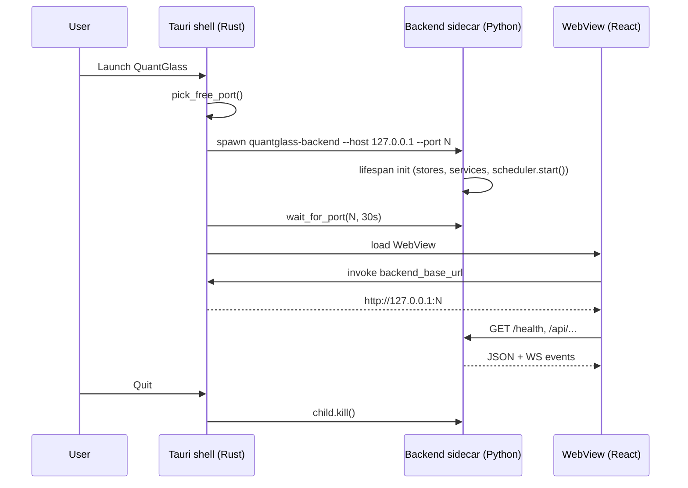

# 1. Architecture overview

[← Technical index](README.md) · [Next: Backend →](02-backend.md)

---

QuantGlass is a **single‑user, local‑first desktop application**. There is no multi‑tenant server, no login, and no required network service beyond the public market/news APIs it reads. The entire system ships as one desktop binary that internally runs a Python backend.

---

## Design principles

| Principle | Implementation |
|-----------|----------------|
| **Local‑first** | All state under a per‑user OS data dir; SQLite + DuckDB + Parquet on disk. |
| **Deterministic core** | Signals computed from closed candles only; no randomness; reproducible. |
| **Optional, guarded AI** | LLM narration can use local or API gateways and is fact‑checked; never on the hot path. |
| **Extension-ready** | Provider, AI, strategy, indicator, and notification extensions register through explicit manifests. |
| **Safety by default** | Paper trading only; live execution multi‑gated. |
| **US‑compliant data** | Coinbase/Kraken/Gemini/Yahoo/Finnhub; global Binance/OKX/Bybit excluded. |
| **Contracts‑first** | Shared TypeScript types in `@quantglass/contracts` mirror backend schemas. |

---

## Technology stack

| Layer | Technology |
|-------|------------|
| **Desktop shell** | Tauri v2 (Rust), `tauri-plugin-shell` for the sidecar |
| **Frontend** | React 19, TypeScript, Vite 6, Tailwind CSS, react‑router‑dom 7 (hash routing), Lightweight Charts |
| **Backend** | Python, FastAPI 0.1.0, Uvicorn, Pydantic v2 / pydantic‑settings, APScheduler |
| **Analytics** | DuckDB (hot query store) + Parquet (durable archive) |
| **Operational state** | SQLite |
| **Secrets** | Fernet symmetric encryption + OS keychain |
| **AI** | Ollama native, LM Studio/OpenAI/OpenAI-compatible chat completions; template fallback |
| **Market data** | ccxt (Coinbase/Kraken), Gemini, Yahoo (public); Alpaca/Finnhub/Polygon/Twelve Data (keyed) |
| **Packaging** | PyInstaller (sidecar) + Tauri bundler (AppImage/deb/rpm, MSI/NSIS, dmg) |

---

## Runtime topology

Key properties:

- The Rust shell asks the OS for a **free loopback port**, spawns the Python sidecar bound to it, and waits up to **30 s** for it to accept connections before the UI issues requests.
- The frontend discovers the URL through the `backend_base_url` Tauri command (falling back to `http://127.0.0.1:8000` in dev).
- On exit, the shell **kills the sidecar**, so no orphan process remains.

See [Packaging & distribution](08-packaging.md) for the full bundling pipeline.

---

## Module responsibilities

| Module | Responsibility |
|--------|----------------|
| `app/main.py` | FastAPI app, lifespan wiring, CORS, router registration. |
| `app/core/config.py` | Settings, provider routes, safety/AI defaults, storage path derivation. |
| `app/api/routes/*` | HTTP endpoints (10 routers). |
| `app/services/*` | Business logic: signal engine, market corridor, execution, narration, ranking, notifications, trading, event bus, rate limits. |
| `app/extensions/*` | Disabled-by-default Python entry-point extension registry. |
| `app/providers/*` | Provider registry and adapters (public/keyed/internal). |
| `app/storage/*` | `StateStore` (SQLite), `AnalyticsStore` (DuckDB/Parquet), `SecretStore`. |
| `app/scheduler.py` | APScheduler background jobs. |
| `src-tauri/src/lib.rs` | Sidecar lifecycle + `backend_base_url` command. |
| `src/lib/backend.ts` | Typed `BackendClient` used by every screen. |

---

[← Technical index](README.md) · [Next: Backend →](02-backend.md)
