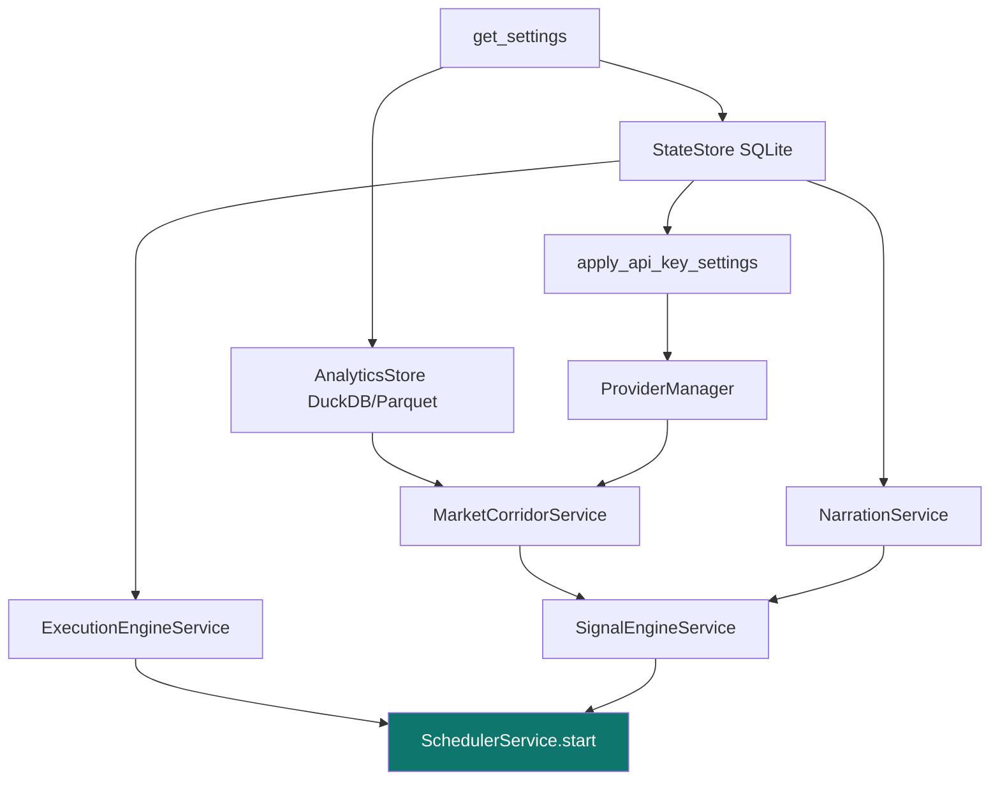

# 2. Backend

[← Architecture](01-architecture.md) · [Technical index](README.md) · [Next: Data model →](03-data-model.md)

---

The backend is a **FastAPI** application (`title="AlphaTerminal Backend"`, `version="0.1.0"`) defined in [apps/backend/app/main.py](../../apps/backend/app/main.py). It is composed entirely with an `asynccontextmanager` **lifespan** that builds every store, service and the scheduler at startup and tears the scheduler down on shutdown.

---

## Application bootstrap (lifespan)



The constructed objects are attached to `app.state` so route handlers can resolve them per request:
`settings`, `state_store`, `analytics_store`, `provider_manager`, `event_bus`, `notification_service`, `trading_service`, `execution_engine`, `market_corridor_service`, `signal_engine`, `scheduler_service`, `rate_limiter`.

---

## Routers

Ten routers are registered in `main.py`:

| Router | Module | Area |
|--------|--------|------|
| health | `routes/health.py` | Liveness + component status. |
| content | `routes/content.py` | News and static content. |
| market | `routes/market.py` | Ranking, corridor candles/diagnostics, refresh. |
| paper | `routes/paper.py` | Paper account and trade intents. |
| providers | `routes/providers.py` | Provider settings + registry. |
| settings | `routes/settings.py` | AI settings, API keys, notification tests. |
| strategies | `routes/strategies.py` | Saved strategies + backtests. |
| watchlist | `routes/watchlist.py` | Watchlist CRUD. |
| alerts | `routes/alerts.py` | Alerts + history. |
| events | `routes/events.py` | WebSocket event stream. |

Full endpoint catalog: [API reference](06-api-reference.md).

---

## Services

| Service | File | Responsibility |
|---------|------|----------------|
| **SignalEngineService** | `services/signal_engine.py` | Computes indicators, regime, setups, confidence; attaches backtests + narration. |
| **MarketCorridorService** | `services/market_corridor.py` | Fetches/normalizes closed candles via providers, persists to analytics, integrity diagnostics. |
| **ExecutionEngineService** | `services/execution_engine.py` | Evaluates alerts, runs paper executions, emits notifications/events. |
| **TradingExecutionService** | `services/trading.py` | Broker order plumbing (paper now; live gated). |
| **NarrationService** | `services/narration.py` | LLM/template narration with fact‑guard. |
| **RankingService** | `services/ranking.py` | Relative‑strength scoring across symbols. |
| **AlertNotificationService** | `services/notifications.py` | Desktop/Telegram/email delivery + test. |
| **BackendEventBus** | `services/event_bus.py` | In‑process pub/sub feeding the WebSocket. |
| **InMemoryRateLimiter** | `services/rate_limits.py` | Per‑market provider rate limiting. |
| **News service** | `services/news_service.py` | News aggregation. |

---

## Scheduler

`SchedulerService` ([app/scheduler.py](../../apps/backend/app/scheduler.py)) runs APScheduler background jobs that keep state fresh without user interaction:

| Job | Cadence (approx.) | Purpose |
|-----|-------------------|---------|
| `market-refresh` | ~5 min | Pull latest closed candles through the corridor. |
| `signal-refresh` | ~5 min | Recompute signals from refreshed candles. |
| `alert-evaluator` | 1 min | Evaluate armed alerts, fire + record history. |
| `paper-execution` | 30 s | Progress paper trade intents/positions. |
| `provider-heartbeat` | 15 min | Probe provider availability for the registry. |

> A correctly started backend reports **all five** jobs. A stale instance missing jobs is a sign of an old process on the port — see [Troubleshooting](10-development.md#operational-notes).

---

## Providers

The `ProviderManager` ([app/providers/manager.py](../../apps/backend/app/providers/manager.py)) resolves a **route** (primary → secondary → fallback) per data domain from `ProviderSettings`. Adapters are grouped by transport:

| Transport | File | Examples |
|-----------|------|----------|
| **public** | `providers/public.py` | `ccxt_coinbase`, `ccxt_kraken`, `gemini`, `yahoo_public` |
| **keyed** | `providers/keyed.py` | `alpaca`, `finnhub`, `polygon`, `twelvedata`, `finnhub_news` |
| **internal** | base/manager | `ollama`, `openai`, `alpaca_paper`, `ccxt_trade` |

Default routes (from `config.py`):

```
crypto : ccxt_coinbase → ccxt_kraken → gemini
stocks : yahoo_public
news   : finnhub_news
ai     : ollama → openai
trading: alpaca_paper → ccxt_trade
```

Rate limits default to `crypto_rate_limit_per_minute = 24` and `stocks_rate_limit_per_minute = 58`.

---

## Configuration

`AppSettings` (pydantic‑settings, env prefix `ALPHATERMINAL_`, nested delimiter `__`) centralises configuration:

- **Storage paths** are derived from `data_dir` unless explicitly set, so a single `ALPHATERMINAL_DATA_DIR` relocates everything. In a frozen (PyInstaller) build, `data_dir` resolves to the per‑user OS app‑data dir; in a source checkout it is `apps/backend/.local`.
- **Sub‑models:** `ProviderSettings`, `SafetySettings` (`trading_mode=paper`, `act_on_partial_candles=False`, `min_backtest_sample=50`, `live_trading_confirmed=False`), `AiSettings` (`model=qwen3:14b-q4_K_M`, `cloud_enabled=False`, `ollama_base_url=http://127.0.0.1:11434`, `request_timeout_seconds=8.0`).
- `apply_api_key_settings()` overlays decrypted API keys from the `StateStore` onto runtime settings at startup.

Full reference: [Development → Configuration reference](10-development.md#configuration-reference).

---

[← Architecture](01-architecture.md) · [Technical index](README.md) · [Next: Data model →](03-data-model.md)
