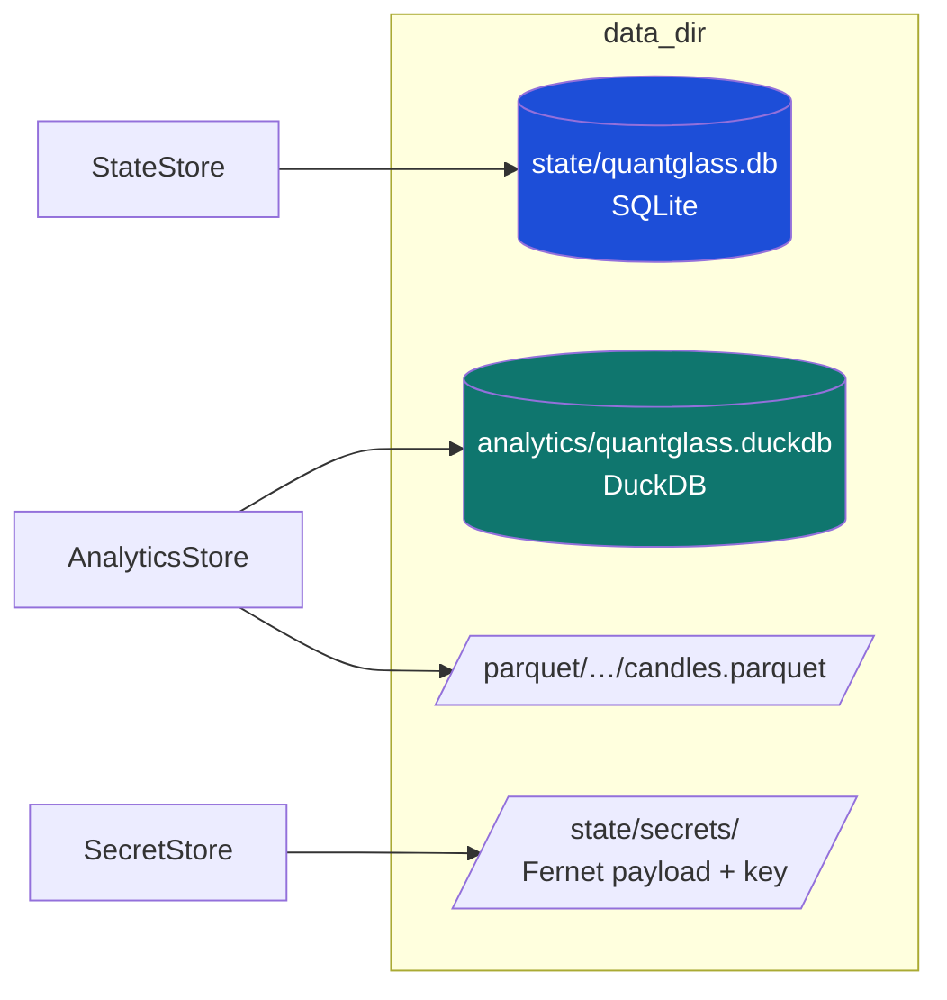

# 3. Data model & storage

[← Backend](02-backend.md) · [Technical index](README.md) · [Next: Signal engine →](04-signal-engine.md)

---

QuantGlass persists three categories of data, each in a purpose‑fit store. All live under the per‑user data directory (see [config](02-backend.md#configuration)).



| Store | Backend | Purpose |
|-------|---------|---------|
| **StateStore** | SQLite | Operational state — fast, transactional, single‑user. |
| **AnalyticsStore** | DuckDB + Parquet | Columnar time‑series + backtest analytics; Parquet is the durable archive. |
| **SecretStore** | Fernet + optional keychain | Encrypted API keys for data, notification, optional AI providers, and trade-capable credentials. |

---

## StateStore (SQLite)

[app/storage/state_store.py](../../apps/backend/app/storage/state_store.py). Initialised with default provider/safety/AI settings. Tables include:

| Table | Holds |
|-------|-------|
| `watchlist_entries` | User‑curated symbols. |
| `saved_strategies` | Strategies saved from Backtesting. |
| `alerts` | Alert definitions + status. |
| `alert_history` | Firing audit log. |
| `paper_account` | Simulated balance / buying power. |
| `paper_positions` | Open simulated positions. |
| `paper_trade_intents` | Queued/working paper orders. |
| `provider_settings` | Persisted provider routing + view mode. |
| `safety_settings` | Trading mode, partial‑candle flag, min sample, live confirm. |
| `ai_settings` | Model, cloud flag, Ollama URL, timeout. |
| `api_keys` | API‑key metadata (values via `SecretStore`). |

---

## AnalyticsStore (DuckDB + Parquet)

[app/storage/analytics_store.py](../../apps/backend/app/storage/analytics_store.py). DuckDB is the hot query store; on every closed‑candle ingest a durable Parquet copy is written.

| Table | Holds |
|-------|-------|
| `market_candles` | OHLCV per symbol/timeframe (closed candles). |
| `backtest_snapshots` | Stored backtest results. |
| `setup_expectancy` | Pooled expectancy per setup family. |
| `market_integrity_diagnostics` | Gap/partial‑candle/quality checks. |
| `market_ingest_runs` | Ingest run metadata. |

Parquet layout:

```
parquet/symbol=<SYMBOL>/timeframe=<TIMEFRAME>/candles.parquet
```

This partitioning makes the archive portable and lets DuckDB history be rebuilt from Parquet after corruption (see [Backup & recovery](../backup_and_recovery.md#parquet-candle-archive)).

---

## SecretStore (Fernet + optional keychain)

[app/storage/secret_store.py](../../apps/backend/app/storage/secret_store.py).

- API keys are encrypted with **Fernet** symmetric encryption; the payload and
  its key live under `state/secrets/`.
- Trade-capable credentials are routed to the OS keychain when one is available;
  if no usable keychain exists, they fall back to the encrypted file.
- The public preview does not include a supported built-in live broker execution
  path. Enforced keychain storage remains a hardening requirement before
  real-money live execution is promoted.

Details: [Security model](09-security.md).

---

## Core schema types

The deterministic contract shared with the frontend (`@quantglass/contracts`) includes:

- **`CanonicalSignal`** — symbol, market type, label (`BUY_ZONE`/`SELL`/`HOLD`/`WAIT`/`WATCH`), status (`active`/`invalidated`/`closed`), confidence, risk level, entry/stop/TP ladder, indicators snapshot, `ConfidenceBasis`, narration.
- **`ConfidenceBasis`** — `trend_alignment`, `volume_confirmation`, `volatility_regime`, `setup_type`, `backtested_winrate`, `backtested_expectancy_R`, `backtest_sample_size`, `out_of_sample_validated`, plus optional `market_regime`, `pooled_*`, `confluence_score`.
- **`BacktestMetrics`** — `winRate`, `avgR`, `expectancy`, `maxDrawdown`, `sharpe`, `sortino`, `profitFactor`, `tradeCount`, `testPeriod`, `inSampleWinRate`, `outOfSampleWinRate`.

These map directly onto the storage tables and the signal engine output ([Signal engine](04-signal-engine.md)).

---

[← Backend](02-backend.md) · [Technical index](README.md) · [Next: Signal engine →](04-signal-engine.md)
