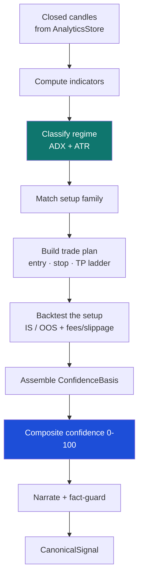
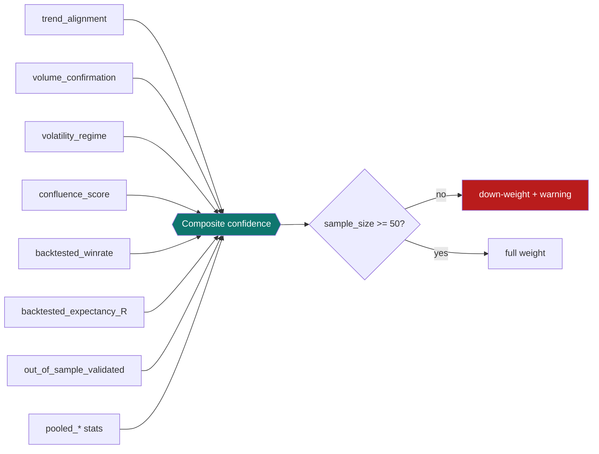

# 4. Signal engine

[← Data model](03-data-model.md) · [Technical index](README.md) · [Next: AI narration →](05-ai-narration.md)

---

`SignalEngineService` ([app/services/signal_engine.py](../../apps/backend/app/services/signal_engine.py)) turns stored closed candles into `CanonicalSignal` objects with an evidence‑based confidence score. It is constructed with the `AnalyticsStore`, the configured `min_backtest_sample` (default **50**), and the `NarrationService`.

> **Closed‑candle discipline:** `act_on_partial_candles` is `False`. The forming bar is excluded (`partial_latest_candle_excluded`) so signals never repaint.

---

## Indicators

The signal engine currently computes the curated core below. Settings ->
Extensions exposes a broader indicator catalog for community implementations and
future chart overlays; catalog-only entries do not affect signals until wired
into an executable path.

| Indicator | Parameters | Role |
|-----------|------------|------|
| EMA | 21 | Short‑term trend. |
| SMA | 50 | Intermediate trend baseline. |
| RSI | 14 (+ fast RSI 2) | Momentum / OB‑OS. |
| MACD | 12, 26, 9 | Trend‑momentum, crossovers. |
| ATR | 14 | Volatility per bar; stop sizing + regime. |
| ADX | 14 | Trend strength; regime driver. |
| Bollinger Bands | 20, 2σ | Volatility envelope / mean reversion. |
| Keltner Channels | 1.5 × ATR | Volatility envelope. |
| Donchian | 20 | Breakout reference. |

---

## Regime classification

Primarily from ADX (trend strength) and ATR (volatility):

| Regime | Heuristic |
|--------|-----------|
| **Trending** | ADX ≥ ~22 |
| **Ranging** | ADX < ~16 |
| **Volatile** | ATR% ≥ ~1.7× its baseline |
| **Transitional** | shifting between the above |

The regime selects which setup family is eligible and feeds the confidence calculation.

---

## Setup families

| Family | Trigger idea |
|--------|--------------|
| **Trend pullback / continuation** | Buy dips with the trend (e.g. EMA reclaim pullback). |
| **Trend rejection / breakdown** | Fade failed pushes against the trend. |
| **Breakout / breakdown retest** | Trade confirmed Donchian breaks on retest. |
| **Mean reversion / range reset** | Fade extremes inside a range. |
| **Momentum confirmation** | Act when momentum and trend agree. |

Each produces a trade plan: entry zone, stop loss, and a **three‑rung take‑profit ladder (50 / 30 / 20%)**, yielding an R:R.

---

## Backtesting

The same setup logic is evaluated historically:

- **Costs:** fees + slippage are applied to every fill.
- **TP ladder:** 50/30/20% scale‑out matches the live plan.
- **Split:** in‑sample / out‑of‑sample, default **70 / 30**; walk‑forward windows for robustness.
- **Sample gate:** results with `tradeCount < min_backtest_sample` (50) are flagged as statistically unstable.

Outputs populate `BacktestMetrics` (`winRate`, `avgR`, `expectancy`, `maxDrawdown`, `sharpe`, `sortino`, `profitFactor`, `tradeCount`, `inSampleWinRate`, `outOfSampleWinRate`) and pooled `setup_expectancy`.

---

## Confidence composition

The `ConfidenceBasis` aggregates independent evidence into a single 0–100 score:

| Field | Contribution |
|-------|--------------|
| `trend_alignment` | Setup with/against dominant trend. |
| `volume_confirmation` | Participation behind the move. |
| `volatility_regime` | Regime suitability for the setup. |
| `setup_type` | Which family fired. |
| `backtested_winrate` / `backtested_expectancy_R` | Historical edge of this setup. |
| `backtest_sample_size` | Reliability weighting; < 50 ⇒ penalty + warning. |
| `out_of_sample_validated` | Whether the edge held on held‑out data. |
| `confluence_score`, `pooled_*`, `market_regime` | Optional robustness signals. |

The result is deterministic: identical candle history yields identical confidence.

---

## Relative‑strength ranking

`RankingService` ([app/services/ranking.py](../../apps/backend/app/services/ranking.py)) blends multiple trailing‑return windows into a 0–100 score and a percentile **within each market type** (crypto vs stocks ranked separately), powering the Dashboard market strip and the Watchlist ordering.

---

[← Data model](03-data-model.md) · [Technical index](README.md) · [Next: AI narration →](05-ai-narration.md)
