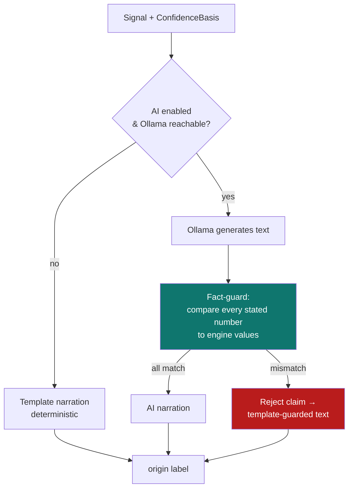

# 5. AI narration & fact‑guard

[← Signal engine](04-signal-engine.md) · [Technical index](README.md) · [Next: API reference →](06-api-reference.md)

---

`NarrationService` ([app/services/narration.py](../../apps/backend/app/services/narration.py)) produces the human‑readable explanation attached to each signal. It is designed so the AI can **never** put a wrong number in front of the user: a deterministic fact‑guard validates every model claim against the engine's actual figures.

---

## Narration sources

| Source | When used |
|--------|-----------|
| **Template** | AI disabled, Ollama unavailable, or request times out (default safety). |
| **Ollama (local LLM)** | When AI is enabled and the model responds within the timeout. |
| **Template‑guarded** | AI produced text but a numeric claim failed the fact‑guard. |

The narration's **origin is always labelled** (e.g. `template`, `template-guarded`, or the model id) so the UI can show provenance.

---

## The fact‑guard

For any numeric claim the model makes (price levels, confidence, win rate, expectancy, R:R, etc.), the guard compares it to the engine's computed value within a tight tolerance. If it doesn't match, that claim is **discarded** and replaced with the verified template phrasing. This prevents hallucinated prices/statistics — a core trust requirement.

---

## Configuration & limits

| Setting | Default | Purpose |
|---------|---------|---------|
| `model` | `qwen3:14b-q4_K_M` | Local Ollama model. |
| `ollama_base_url` | `http://127.0.0.1:11434` | Local model endpoint. |
| `cloud_enabled` | `False` | Cloud narration off by default (local‑first). |
| `request_timeout_seconds` | `8.0` | Hard cap so a slow model never blocks a signal refresh. |

Because narration is strictly **off the hot path** (timeout + template fallback), a missing or slow Ollama never delays signals — they simply ship with template explanations. Configure via [`PUT /api/settings/ai`](06-api-reference.md#settings) or [Settings → AI](../user-guide/10-settings.md#ai).

---

[← Signal engine](04-signal-engine.md) · [Technical index](README.md) · [Next: API reference →](06-api-reference.md)
