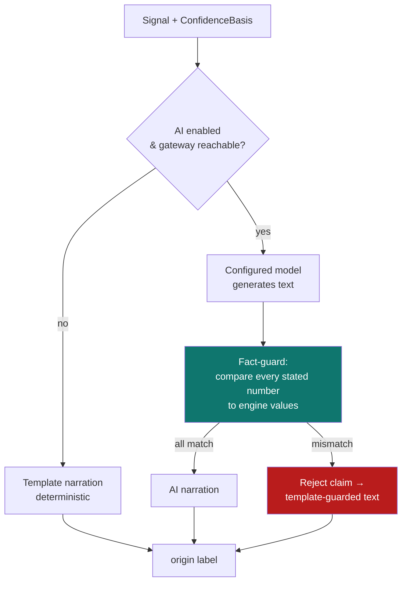

# 5. AI narration & fact‑guard

[← Signal engine](04-signal-engine.md) · [Technical index](README.md) · [Next: API reference →](06-api-reference.md)

---

`NarrationService` ([app/services/narration.py](../../apps/backend/app/services/narration.py)) produces the human‑readable explanation attached to each signal. It is designed so the AI can **never** put a wrong number in front of the user: a deterministic fact‑guard validates every model claim against the engine's actual figures.

`ModelGateway` ([app/services/model_gateway.py](../../apps/backend/app/services/model_gateway.py)) keeps model integrations vendor-neutral. Ollama can use its native local endpoint, while LM Studio, OpenAI, and custom gateways use an OpenAI-compatible `chat/completions` shape.

---

## Narration sources

| Source                        | When used                                                                                         |
| ----------------------------- | ------------------------------------------------------------------------------------------------- |
| **Template**                  | AI disabled, Ollama unavailable, or request times out (default safety).                           |
| **Ollama native**             | When AI is enabled with `provider=ollama` and the local model responds within the timeout.        |
| **OpenAI-compatible gateway** | When AI is enabled with `provider=lm_studio`, `provider=openai`, or `provider=openai_compatible`. |
| **Template‑guarded**          | AI produced text but a numeric claim failed the fact‑guard.                                       |

The narration's **origin is always labelled** (e.g. `template`, `template-guarded`, or the model id) so the UI can show provenance.

---

## The fact‑guard

For any numeric claim the model makes (price levels, confidence, win rate, expectancy, R:R, etc.), the guard compares it to the engine's computed value within a tight tolerance. If it doesn't match, that claim is **discarded** and replaced with the verified template phrasing. This prevents hallucinated prices/statistics — a core trust requirement.

---

## Configuration & limits

| Setting                   | Default                  | Purpose                                                                          |
| ------------------------- | ------------------------ | -------------------------------------------------------------------------------- |
| `provider`                | `ollama`                 | `template`, `ollama`, `lm_studio`, `openai`, or `openai_compatible`.             |
| `model`                   | `qwen3:14b-q4_K_M`       | Provider model id.                                                               |
| `base_url`                | `http://127.0.0.1:11434` | Native Ollama endpoint or `/v1` OpenAI-compatible base URL.                      |
| `api_key_id`              | `None`                   | Optional stored key id, usually `openai-api-key` or `openai-compatible-api-key`. |
| `temperature`             | `0.2`                    | Low by default to reduce narration drift.                                        |
| `max_tokens`              | `180`                    | Small response cap for concise explanations.                                     |
| `cloud_enabled`           | `False`                  | Cloud narration off by default (local‑first).                                    |
| `request_timeout_seconds` | `8.0`                    | Hard cap so a slow model never blocks a signal refresh.                          |

Because narration is strictly **off the hot path** (timeout + template fallback), a missing or slow model never delays signals — they simply ship with template explanations. Configure via [`PUT /api/settings/ai`](06-api-reference.md#settings) or [Settings → AI](../user-guide/10-settings.md#ai).

## Gateway presets

| Provider            | Typical base URL            | Notes                                                                                           |
| ------------------- | --------------------------- | ----------------------------------------------------------------------------------------------- |
| `ollama`            | `http://127.0.0.1:11434`    | Uses Ollama's native `/api/generate`.                                                           |
| `lm_studio`         | `http://127.0.0.1:1234/v1`  | Uses OpenAI-compatible chat completions.                                                        |
| `openai`            | `https://api.openai.com/v1` | Uses the stored OpenAI key.                                                                     |
| `openai_compatible` | custom `/v1` URL            | Works with compatible local/hosted routers such as vLLM, LiteLLM, LocalAI, or private gateways. |

See [AI model gateways](../contributing/ai-model-gateways.md) for contributor guidance.

---

## The AI surface map

Signal narration was the first surface; the same covenant (engine facts in,
fact‑guarded narration out, labelled source, deterministic fallback) now powers
every AI feature in the app:

| Surface                   | Service / endpoint                                                                                    | Facts narrated                                                                          |
| ------------------------- | ----------------------------------------------------------------------------------------------------- | --------------------------------------------------------------------------------------- |
| Signal explanations       | `NarrationService`; feed is always template, `GET /api/signals/narrate` for on‑demand model narration | Entry/stop/targets, confidence basis, backtest stats                                    |
| Daily brief               | `AiCoachService.daily_brief` · `GET /api/dashboard/brief`                                             | Regimes, top signals, risk warnings                                                     |
| Surface insights          | `AiCoachService.surface_insight` · `GET /api/ai/insight/{surface}`                                    | Per‑screen facts for journal, watchlist, missions, portfolio                            |
| Weekly coach narrative    | `AiCoachService.weekly_narrative` · `GET /api/review/coach/narrative`                                 | Process metrics, 2×2 quadrants, repeated mistakes                                       |
| Lesson tutor              | `AiCoachService.tutor` · `POST /api/learn/lesson/{id}/tutor`                                          | The lesson's own concept text and key terms                                             |
| NL alert creation         | `AiCoachService.parse_alert` · `POST /api/alerts/parse-nl`                                            | Model proposes `{symbol, condition}`; the deterministic parser validates or rejects     |
| Drill & trade postmortems | `AiCoachService.postmortem` · `POST /api/ai/postmortem`                                               | Drill scores/choices, or one trade's plan, process score, outcome                       |
| Backtest AI review        | Part of `POST /api/backtests/run`                                                                     | The run's own metrics, stress and bias‑gate results                                     |
| **QuantGlass Copilot**    | `CopilotService` · `POST /api/copilot/ask`                                                            | Model proposes read‑only tools, engine executes them, model narrates only those results |

Two structural patterns recur:

- **"Model proposes, engine disposes"** — wherever the model's output drives an
  action (alert conditions, Copilot tool selection), a deterministic
  parser/registry validates the proposal and silently drops anything invalid or
  write‑like. The model cannot reach an order or a settings write.
- **Three‑state UI** — every AI panel in the desktop app renders a loading
  state, the narration with a source chip, or an explicit "unavailable" card.
  An AI surface is never silently absent.

The Copilot and the external [MCP server](06-api-reference.md#mcp-server) share
one read‑only tool registry, so an MCP client (e.g. Claude Desktop) and the
in‑app Copilot see exactly the same six tools.

---

[← Signal engine](04-signal-engine.md) · [Technical index](README.md) · [Next: API reference →](06-api-reference.md)
