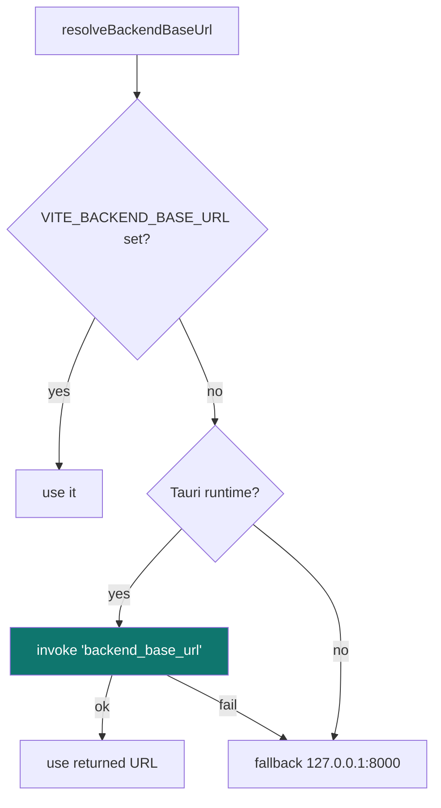

# 7. Frontend

[← API reference](06-api-reference.md) · [Technical index](README.md) · [Next: Packaging →](08-packaging.md)

---

The frontend is a **React 19 + TypeScript** single‑page app built with **Vite 6** and styled with **Tailwind CSS**, rendered inside the Tauri webview. Charts use **Lightweight Charts**. Routing uses **react‑router‑dom 7** with **hash routing** (e.g. `#/signals`).

<p align="center">
  
</p>

---

## Source layout

```
apps/desktop/src/
├── App.tsx          Router, layout shell, backend connection state
├── main.tsx         React bootstrap
├── screens/         One component per route
├── components/      Reusable UI (cards, chart, nav, badges)
├── lib/             backend.ts (client) · analytics.ts · format.ts
├── data/            static/seed data
├── types.ts         local view types
└── index.css        Tailwind entry
```

### Screens

| Screen | Route | Purpose |
|--------|-------|---------|
| `DashboardScreen` | `#/` | Cross‑market overview, regime, paper snapshot, signal feed. |
| `SignalsScreen` | `#/signals` | Filterable signal inventory. |
| `WatchlistScreen` | `#/watchlist` | Relative‑strength candidates + curation. |
| `SymbolDetailScreen` | `#/symbol/:id` | Chart, overlays, decision card, catalysts. |
| `BacktestScreen` | `#/backtest` | Strategy selection + IS/OOS metrics. |
| `AlertsScreen` | `#/alerts` | Alert management + history. |
| `SettingsScreen` | `#/settings` | Providers, API keys, risk, AI, strategies. |
| `SignalDetailDrawer` | (overlay) | Inline signal detail. |

---

## Backend connection bootstrap

The app must learn which port the sidecar is on before making requests.



`resolveBackendBaseUrl()` in [src/lib/backend.ts](../../apps/desktop/src/lib/backend.ts):

1. If `VITE_BACKEND_BASE_URL` is set (dev override), use it.
2. Else if running under Tauri (`__TAURI_INTERNALS__` present), `invoke('backend_base_url')` to get the sidecar URL.
3. Else fall back to `http://127.0.0.1:8000`.

The resolved URL is memoised in a single promise so every request shares it.

---

## BackendClient & contracts

`backend.ts` is a typed client whose request/response shapes come from the shared **`@alphaterminal/contracts`** package (`packages/contracts`). This contracts‑first approach keeps the TypeScript types in lockstep with the backend's Pydantic schemas. Representative types:

| Type | Used for |
|------|----------|
| `SignalsListResponse` / `CanonicalSignal` | `/api/signals`. |
| `MarketRankingResponse` | `/api/market/ranking`. |
| `MarketCandlesResponse` | corridor candles for charts. |
| `BacktestRunRequest` / `BacktestRunResponse` | backtests. |
| `AlertsListResponse` / `AlertUpsertRequest` | alerts CRUD. |
| `PaperAccountResponse` / `PaperTradeIntentRequest` | paper trading. |
| `ProviderSettingsResponse` / `ProviderRegistryResponse` | providers. |
| `AiSettingsResponse` / `ApiKeySettingsResponse` | settings. |

The client also maps internal provider ids to display labels (`providerLabelById`, e.g. `ccxt_coinbase → Coinbase`).

---

## Real‑time updates

The frontend subscribes to the WebSocket at `/ws/events`; `BackendEventMessage` payloads (signal updates, alert firings, paper fills) drive live UI refreshes without polling, complementing the scheduler‑driven backend refresh cadence.

---

[← API reference](06-api-reference.md) · [Technical index](README.md) · [Next: Packaging →](08-packaging.md)
