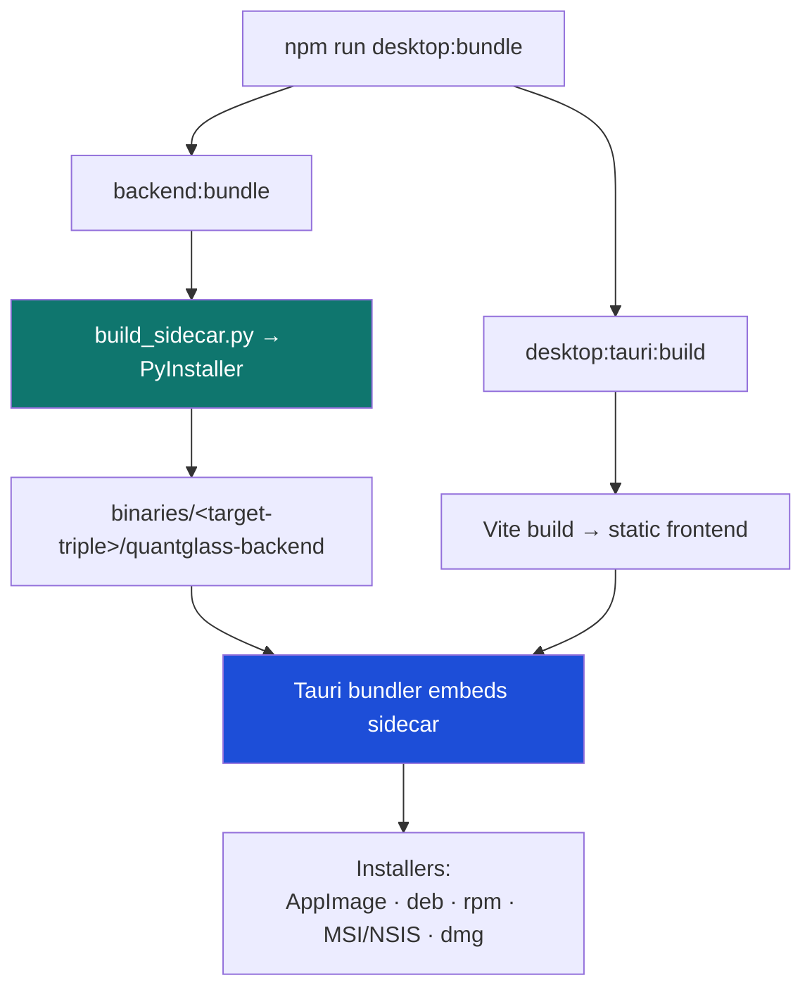
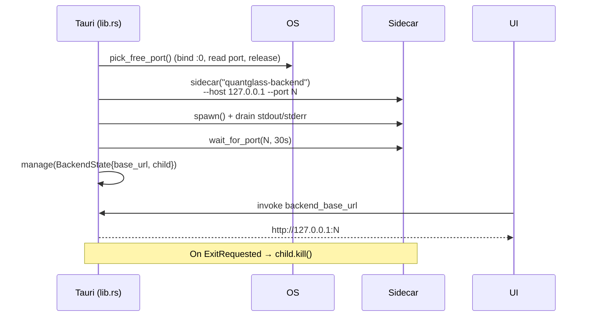

# 8. Packaging & distribution

[← Frontend](07-frontend.md) · [Technical index](README.md) · [Next: Security model →](09-security.md)

---

QuantGlass ships as a **single desktop installer per platform**. The Python backend is frozen into a self‑contained binary with **PyInstaller**, embedded as a Tauri **sidecar (externalBin)**, and the Rust shell launches it at runtime. The user never installs Python, Node or any server.



---

## Step 1 — Freeze the backend (sidecar)

`apps/backend/scripts/build_sidecar.py` runs PyInstaller to produce a single‑file backend executable, then places it under the Tauri binaries directory named by **target triple**:

```
apps/desktop/src-tauri/binaries/<target-triple>/quantglass-backend[.exe]
```

Tauri requires the triple suffix (e.g. `quantglass-backend-x86_64-unknown-linux-gnu`) so it can pick the right binary per platform. The Tauri config registers it as an `externalBin`.

Command: `npm run backend:bundle`.

## Step 2 — Build the frontend

`npm run desktop:build` runs the Vite production build, emitting static assets the webview loads.

## Step 3 — Bundle with Tauri

`npm run desktop:tauri:build` compiles the Rust shell, embeds the frozen sidecar and static frontend, and emits platform installers.

Combined: `npm run desktop:bundle` (= `backend:bundle` + `desktop:tauri:build`).

---

## Runtime: how the shell starts the sidecar

`apps/desktop/src-tauri/src/lib.rs`:



Key functions:

| Function                                 | Role                                                                           |
| ---------------------------------------- | ------------------------------------------------------------------------------ |
| `pick_free_port()`                       | Bind `127.0.0.1:0`, read the OS‑assigned port, release it for the backend.     |
| `start_backend()`                        | Spawn the sidecar on that port; continuously drain its pipes; `wait_for_port`. |
| `wait_for_port()`                        | Poll TCP connect every 150 ms up to a 30 s deadline.                           |
| `backend_base_url` (`#[tauri::command]`) | Hand the resolved URL to the frontend.                                         |
| `FALLBACK_BASE_URL`                      | `http://127.0.0.1:8000` when no sidecar is managed (e.g. `tauri dev`).         |
| `ExitRequested` handler                  | `child.kill()` so no orphan backend remains.                                   |

Stdout/stderr are drained continuously so the child's pipe never fills and stalls it.

---

## Artifacts

| Platform    | Outputs                                                                                          |
| ----------- | ------------------------------------------------------------------------------------------------ |
| **Linux**   | `QuantGlass_0.1.0_amd64.AppImage`, `QuantGlass_0.1.0_amd64.deb`, `QuantGlass-0.1.0-1.x86_64.rpm` |
| **Windows** | MSI / NSIS installer (`.exe`)                                                                    |
| **macOS**   | `.dmg` / `.app`                                                                                  |

> Distribution uses local build commands only — **no CI/CD pipeline** is required to produce installers.

---

## Data directory in packaged builds

When frozen (`sys.frozen` is true), `config.py` resolves `data_dir` to the per‑user OS app‑data location instead of the source `.local` folder:

| OS      | Data folder                                |
| ------- | ------------------------------------------ |
| Linux   | `~/.local/share/QuantGlass`                |
| Windows | `%APPDATA%\QuantGlass`                     |
| macOS   | `~/Library/Application Support/QuantGlass` |

A single `QUANTGLASS_DATA_DIR` env var relocates all state.

---

## Release validation

`npm run validate:release` chains: backend checks + tests + smoke + OpenAPI export, then the frontend build, the sidecar freeze, and the Tauri bundle — a full end‑to‑end gate before shipping.

---

[← Frontend](07-frontend.md) · [Technical index](README.md) · [Next: Security model →](09-security.md)
