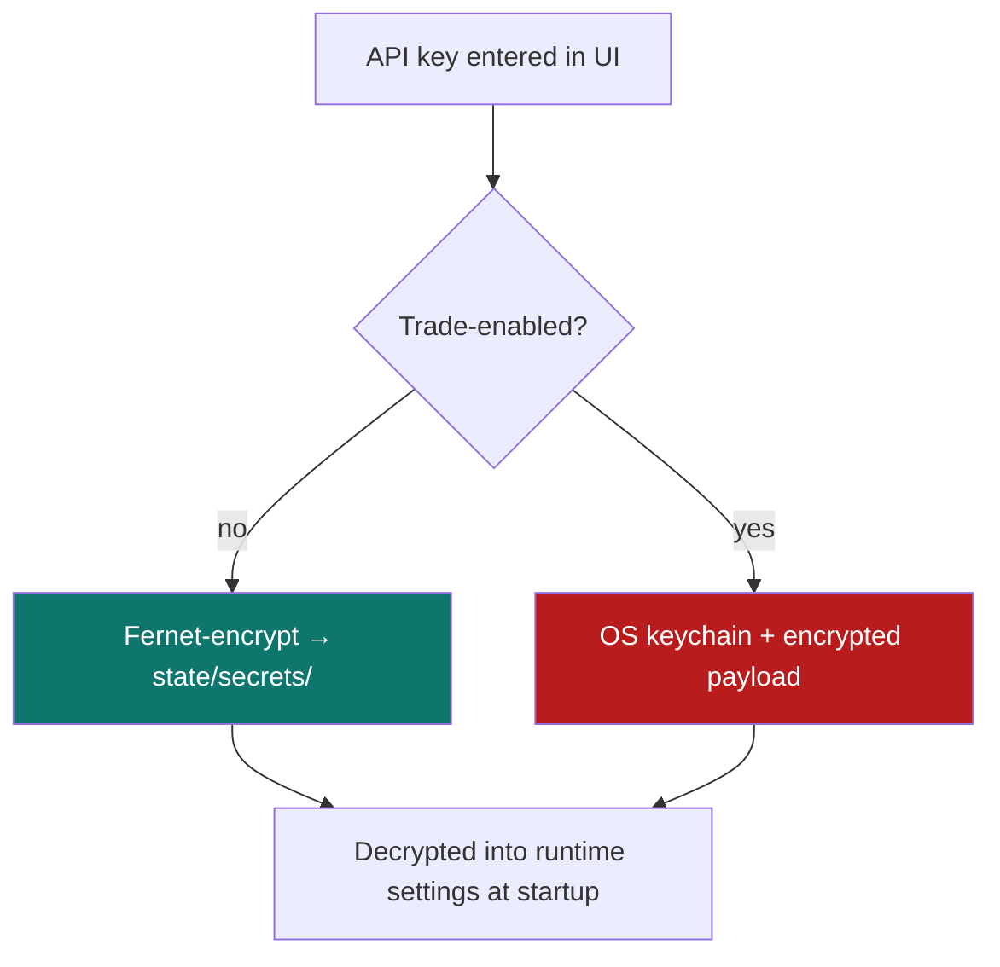
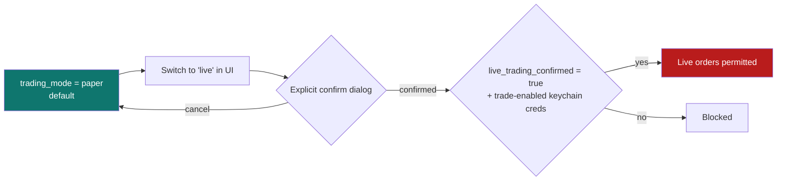

# 9. Security model

[← Packaging](08-packaging.md) · [Technical index](README.md) · [Next: Development →](10-development.md)

---

AlphaTerminal's threat model is a **single‑user desktop app**: no remote attackers, no multi‑tenant data, no inbound network surface beyond a loopback‑only backend. Security focuses on protecting **secrets at rest** and preventing **accidental real‑money trades**.

---

## Loopback‑only backend

The backend binds to `127.0.0.1` on a randomly chosen free port and is reached only by the local webview. It is never exposed on a public interface.

### CORS

`CORSMiddleware` allows only local dev origins and the Tauri webview, with **credentials disabled**:

```
http://127.0.0.1:1420 / localhost:1420
http://127.0.0.1:4173 / localhost:4173
http://127.0.0.1:5173 / localhost:5173
tauri://localhost
http(s)://tauri.localhost
```

`allow_credentials=False`, `allow_methods=["*"]`, `allow_headers=["*"]`.

---

## Secrets at rest



| Credential type | Storage |
|-----------------|---------|
| **Data/news/notification keys** | Fernet‑encrypted payload + key under `state/secrets/`. |
| **Trade‑enabled credentials** | Additionally bound to the **OS keychain** — not recoverable from the DB alone. |

Keys are **masked** in the UI. `apply_api_key_settings()` overlays decrypted keys onto runtime settings only in memory at startup.

> **Backups contain secrets.** A backup bundle includes the encrypted payload *and* its decryption key — treat bundles as sensitive and store them securely ([Backup & recovery](../backup_and_recovery.md)).

---

## The live‑trading gate

Real‑money execution is intentionally hard to enable:



`SafetySettings` defaults: `trading_mode="paper"`, `live_trading_confirmed=False`. A plain DB flag is **not** sufficient — the code requires a keychain‑stored trade credential, so live trading cannot be enabled by editing the database alone. Currently only **paper execution** is implemented.

---

## Determinism & anti‑hallucination

- Signals use **closed candles only** (`act_on_partial_candles=False`) — reproducible, no repaint.
- AI narration is **fact‑guarded**: numeric claims that disagree with engine values are rejected ([AI narration](05-ai-narration.md)). The LLM cannot surface a fabricated price or statistic.

---

## Privacy

- **No cloud account, no telemetry** by default; `cloud_enabled=False` for AI.
- All state is local; outbound traffic is limited to the public/keyed market & news providers you actually use.

---

## OWASP‑aligned notes

| Risk | Mitigation |
|------|------------|
| Sensitive data exposure | Fernet + keychain; masked UI; loopback‑only API. |
| Broken access control | Single‑user local app; no remote auth surface. |
| Injection | Parameterised storage queries; typed Pydantic/contracts boundaries. |
| Security misconfiguration | Restrictive CORS; safe defaults (paper, local AI). |

---

[← Packaging](08-packaging.md) · [Technical index](README.md) · [Next: Development →](10-development.md)
