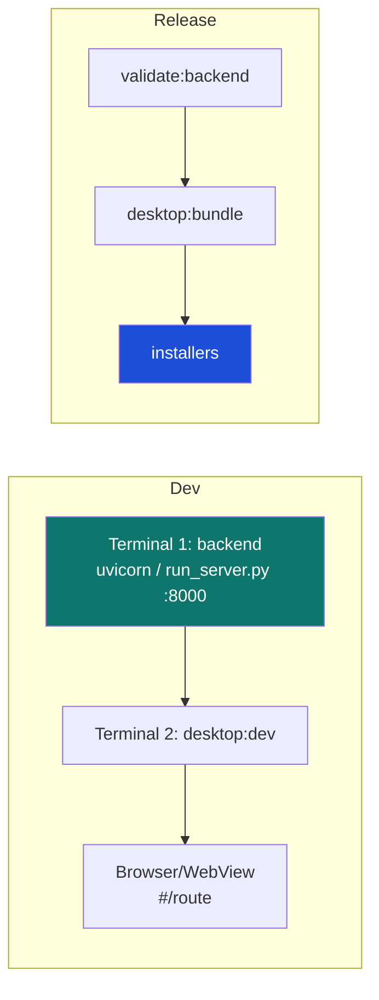

# 10. Development & operations

[← Security model](09-security.md) · [Technical index](README.md)

---

This document covers local development, the npm script surface, testing, and the configuration reference.

---

## Prerequisites

| Tool | Used for |
|------|----------|
| **Python** (venv at `./.venv`) | Backend. |
| **Node.js + npm** | Frontend + orchestration scripts. |
| **Rust toolchain** | Tauri shell build. |
| **Ollama** (optional) | Local AI narration. |
| **PyInstaller** | Sidecar freeze (installed in the venv). |

> The repository scripts assume the virtualenv at `./.venv`. From the workspace root the backend Python is `./.venv/bin/python`.

---

## npm scripts (root `package.json`)

| Script | Action |
|--------|--------|
| `desktop:dev` | Vite dev server for the UI. |
| `desktop:build` | Production frontend build. |
| `desktop:preview` | Preview the built frontend. |
| `desktop:tauri:dev` | Run the Tauri shell in dev (uses fallback backend URL). |
| `desktop:tauri:build` | Build platform installers. |
| `backend:bundle` | Freeze the backend sidecar (PyInstaller). |
| `desktop:bundle` | `backend:bundle` + `desktop:tauri:build`. |
| `backend:check` | Import the app and print title + route count. |
| `backend:openapi` | Export the OpenAPI spec. |
| `backend:smoke` | Run the smoke test. |
| `backend:test` | Run the backend unittest suite. |
| `backend:backup` | Export a timestamped state bundle. |
| `validate:backend` | check + test + smoke + openapi. |
| `validate:release` | validate:backend + frontend build + sidecar + Tauri bundle. |

---

## Typical workflows

**Develop the UI against a live backend**

1. Start the backend on the conventional port (`127.0.0.1:8000`).
2. `npm run desktop:dev` and open the hash route (e.g. `#/signals`).
   The frontend falls back to `127.0.0.1:8000` outside Tauri.

**Develop the full desktop app**

- `npm run desktop:tauri:dev` runs the shell; with no bundled sidecar it uses the fallback URL, so run a backend separately.

**Produce installers**

- `npm run desktop:bundle` (or `validate:release` for the full gated pipeline).

---

## Testing

| Command | Scope |
|---------|-------|
| `npm run backend:test` | `unittest discover` over `apps/backend/tests/test_*.py`. |
| `npm run backend:smoke` | End‑to‑end smoke of the app. |
| `npm run backend:check` | Quick import + route‑count sanity. |
| `npm run backend:openapi` | Regenerate `docs/openapi/...json`; diff to catch contract drift. |

---

## Operational notes

- **Stale backend on the dev port.** A previous backend left on `:8000` may be missing scheduler jobs or routes. Confirm a fresh instance reports **all five** jobs (`market-refresh`, `signal-refresh`, `alert-evaluator`, `paper-execution`, `provider-heartbeat`). Free the port before relaunching.
- **Closed‑candle guarantee.** `act_on_partial_candles=False` is enforced; expect signals to update only on bar close.
- **Data location.** Source runs keep state in `apps/backend/.local`; frozen builds use the OS app‑data dir.

---

## Configuration reference

Environment variables use the prefix `ALPHATERMINAL_` with `__` for nesting (e.g. `ALPHATERMINAL_SAFETY__TRADING_MODE=paper`).

| Setting | Default | Notes |
|---------|---------|-------|
| `data_dir` | `.local` (source) / OS app‑data (frozen) | One override relocates all state. |
| `sqlite_path` | `<data_dir>/state/alphaterminal.db` | Operational state. |
| `duckdb_path` | `<data_dir>/analytics/alphaterminal.duckdb` | Analytics. |
| `parquet_dir` | `<data_dir>/parquet` | Durable candle archive. |
| `safety.trading_mode` | `paper` | `paper` / `live`. |
| `safety.act_on_partial_candles` | `false` | Closed candles only. |
| `safety.min_backtest_sample` | `50` | Below ⇒ instability warning. |
| `safety.live_trading_confirmed` | `false` | Plus keychain creds required for live. |
| `ai.model` | `qwen3:14b-q4_K_M` | Local Ollama model. |
| `ai.cloud_enabled` | `false` | Cloud narration off. |
| `ai.ollama_base_url` | `http://127.0.0.1:11434` | Local endpoint. |
| `ai.request_timeout_seconds` | `8.0` | Narration hard cap. |
| `provider_settings.crypto_rate_limit_per_minute` | `24` | Crypto provider limit. |
| `provider_settings.stocks_rate_limit_per_minute` | `58` | Stocks provider limit. |
| `enable_*_market_data` + keys | `false` / unset | Optional keyed providers (Alpaca/Finnhub/Polygon/Twelve Data). |

---

[← Security model](09-security.md) · [Technical index](README.md)
