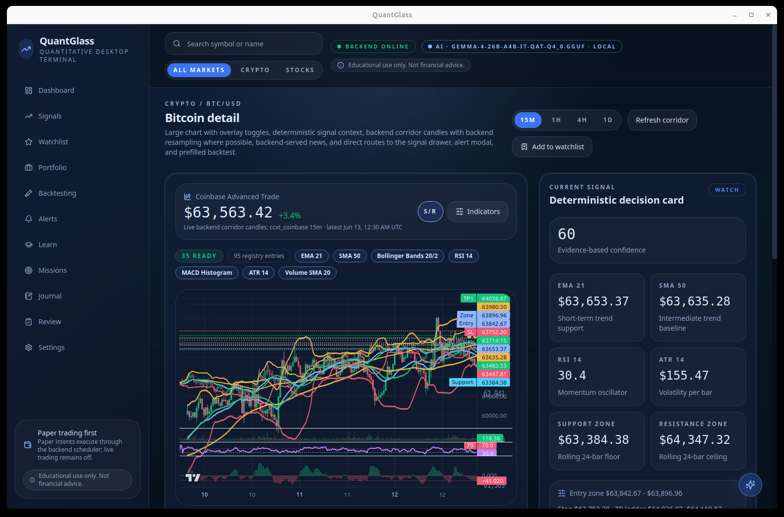
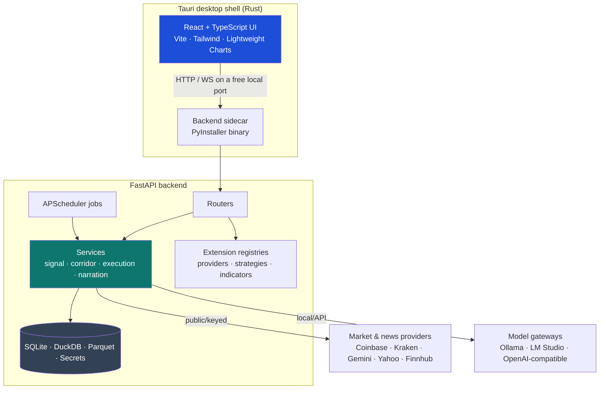

# QuantGlass — Technical Documentation

> Engineering reference for **QuantGlass**, a local‑first quantitative desktop terminal. This set documents the architecture, backend, signal engine, data model, API, frontend, packaging, security and developer workflows. For the end‑user manual, see the [User Guide](../user-guide/README.md).

<p align="center">
  
</p>

---

## Table of contents

| #   | Document                                                           | Scope                                                                          |
| --- | ------------------------------------------------------------------ | ------------------------------------------------------------------------------ |
| 1   | [Architecture overview](01-architecture.md)                        | System design, tech stack, monorepo layout, runtime topology                   |
| 2   | [Backend](02-backend.md)                                           | FastAPI app, routers, services, scheduler, providers, config                   |
| 3   | [Data model & storage](03-data-model.md)                           | SQLite state, DuckDB/Parquet analytics, secret store                           |
| 4   | [Signal engine](04-signal-engine.md)                               | Indicators, regimes, setup families, backtesting, confidence                   |
| 5   | [AI narration & fact‑guard](05-ai-narration.md)                    | Local/API model gateways, template fallback, anti‑hallucination                |
| 6   | [API reference](06-api-reference.md)                               | Every REST endpoint and the WebSocket event stream                             |
| 7   | [Frontend](07-frontend.md)                                         | React app, screens, BackendClient, contracts, bootstrap                        |
| 8   | [Packaging & distribution](08-packaging.md)                        | PyInstaller sidecar, Tauri bundling, startup sequence                          |
| 9   | [Security model](09-security.md)                                   | Local secret encryption, live‑trading gate, CORS                               |
| 10  | [Development & operations](10-development.md)                      | Scripts, build/dev, testing, configuration reference                           |
| 11  | [Streaming quotes exploration](11-streaming-quotes-exploration.md) | PAR-6 assessment: why fills stay on closed candles, and the quote-polling lane |

---

## System at a glance



- **One executable, no servers.** The desktop app launches the Python backend as a bundled **sidecar** on a free loopback port and shuts it down on exit.
- **Local‑first.** All state lives in a per‑user OS data directory. No cloud account, no telemetry by default.
- **Deterministic core, optional AI.** Signals are reproducible; the LLM only narrates and is **fact‑guarded**.

---

## Repository layout

```
quantglass/
├── apps/
│   ├── backend/        FastAPI engine (Python)
│   │   ├── app/        api · core · providers · services · storage
│   │   ├── scripts/    build_sidecar.py · export_openapi.py · manage_state_bundle.py
│   │   └── tests/
│   └── desktop/        React + Tauri app (TypeScript + Rust)
│       ├── src/        screens · components · lib · data
│       └── src-tauri/  Rust shell (lib.rs spawns the sidecar)
├── packages/
│   └── contracts/      Shared TypeScript API types (@quantglass/contracts)
└── docs/               Vision, milestones, OpenAPI, user-guide, technical
```

---

## Related documents

- [Vision & architecture v2](../financial_signal_app_vision_architecture_v2.md)
- [Production implementation masterplan](../production_implementation_masterplan.md)
- [Release readiness checklist](../release_readiness_checklist.md)
- [Backup & recovery](../backup_and_recovery.md)
- [OpenAPI specification](../openapi/quantglass-backend.openapi.json)
- [Milestone phases](../milestones/README.md)

Start with **[1. Architecture overview →](01-architecture.md)**
