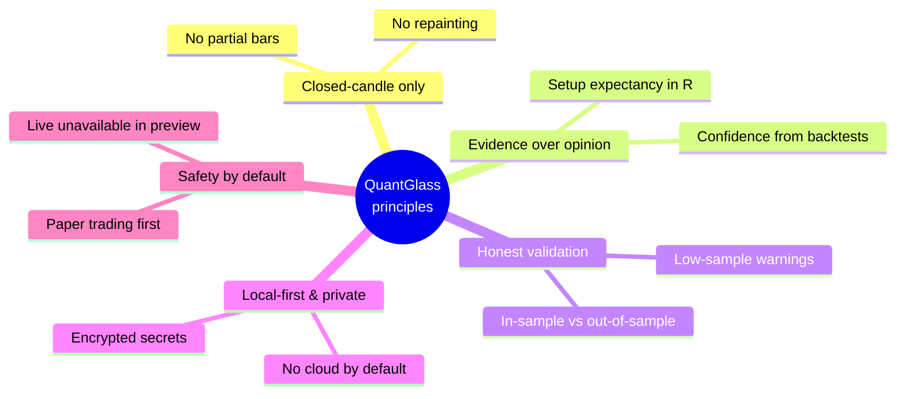

# 1. Introduction

[← Back to contents](README.md) · [Next: Installation →](02-installation.md)

---

## What is QuantGlass?

QuantGlass is a **desktop application** that helps you analyse markets the way a disciplined quantitative trader would. Instead of showing you a wall of indicators and leaving you to guess, it produces a single, explainable answer for each symbol and timeframe:

> *"Here is the signal, here is exactly why, here is how it performed in a backtest, and here is how confident the evidence makes us."*

It covers two asset classes out of the box:

- **Crypto** — BTC, ETH, SOL, LINK (via Coinbase, Kraken and Gemini public data).
- **US equities & ETFs** — SPY, QQQ, AAPL, MSFT, NVDA, TSLA, COIN, IWM (via Yahoo Finance public data).

Everything runs **on your own computer**. The app bundles its own analytics backend, so there is no server to manage and no data leaves your machine unless you deliberately enable a cloud feature.

---

## Who is it for?

| Audience | How QuantGlass helps |
|----------|--------------------------|
| **Active retail traders** | A consistent, rules‑based "second opinion" with honest backtest stats, not hype. |
| **Quant‑curious learners** | See indicators, regimes and expectancy in one place and learn how they combine. |
| **Researchers / tinkerers** | A local, inspectable pipeline you can study, extend and validate. |
| **Privacy‑conscious users** | No accounts, no telemetry, no cloud dependency by default. |

---

## Guiding principles

QuantGlass is built around a small set of non‑negotiable rules. They shape every screen you will use.

### 1. Closed‑candle only
Signals are computed **only on completed candles**. A 1‑hour signal updates when the hour closes — never mid‑bar. This prevents "repainting", where a signal appears and then vanishes as the live bar wiggles. You will see the reminder *"Closed‑candle only"* throughout the app.

### 2. Evidence over opinion
A signal's **confidence** is not a vibe. It is assembled from measurable factors — trend alignment, volume confirmation, the backtested win rate and expectancy of that exact setup, and whether it was validated out‑of‑sample. See [Core concepts → Confidence](11-core-concepts.md#confidence-how-the-number-is-built).

### 3. Honest validation
Backtests always separate **in‑sample** (training) from **out‑of‑sample** (held‑out) performance, and the app warns you loudly when a setup has **too few trades** to trust. Good‑looking numbers on 8 trades are treated as unstable, not as proof.

### 4. Local‑first and private
Your watchlists, strategies, alerts, paper account and downloaded candles all live in a per‑user data folder on your machine. There is no login. See [Backup & recovery](13-backup-recovery.md) for where the files are.

### 5. Safety by default
The app starts in **paper‑trading** mode. Built-in live broker execution is not
available in the public preview; future live support must pass the explicit
safety gate described in [Paper vs live trading](12-paper-trading.md).

---

## What QuantGlass is **not**

- It is **not** a brokerage. It does not custody funds.
- It is **not** a financial adviser. Signals are research hypotheses, not recommendations.
- It is **not** a high‑frequency or tick‑level tool. It works on closed candles (15m, 1h, 4h, 1d).
- It does **not** include offshore or non‑US‑compliant venues by default (Binance.com global, OKX and Bybit are intentionally excluded in the US build).

---

[← Back to contents](README.md) · [Next: Installation →](02-installation.md)
