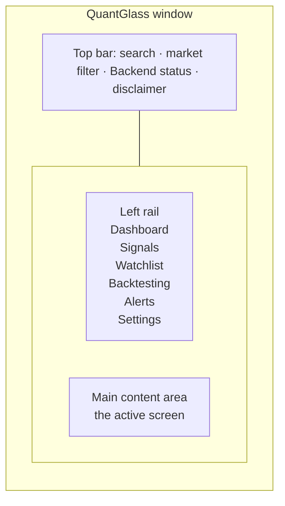
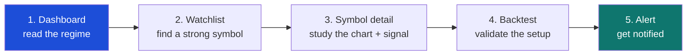

# 3. Getting started

[← Installation](02-installation.md) · [Contents](README.md) · [Next: Dashboard →](04-dashboard.md)

---

## First launch

When QuantGlass opens, the bundled backend starts automatically. Within a few seconds the status pill at the top changes to **● Backend Online** and the **Dashboard** populates with data.

On first run the app seeds a demonstration **paper account** and a default **watchlist** so that every screen has something to show while you explore. You can change all of this later.

---

## The layout

QuantGlass uses a persistent shell: a **left navigation rail**, a **top bar**, and a **main content area** that changes as you navigate.

  

### Top bar
| Element | Purpose |
|---------|---------|
| **Search symbol or name** | Jump to any symbol's detail screen. |
| **All Markets / Crypto / Stocks** | Filter what's shown across the app to one asset class. |
| **Backend status pill** | Live connection health (Online / Connecting / Unavailable). |
| **Educational use only** | The standing disclaimer — QuantGlass is not financial advice. |

### Left navigation rail
| Item | Screen | Guide |
|------|--------|-------|
| Dashboard | Cross‑market overview | [Chapter 4](04-dashboard.md) |
| Signals | Filterable signal inventory | [Chapter 6](06-signals.md) |
| Watchlist | Curated symbols + ranking | [Chapter 5](05-watchlist.md) |
| Backtesting | Strategy validation | [Chapter 8](08-backtesting.md) |
| Alerts | Triggers + history | [Chapter 9](09-alerts.md) |
| Settings | Providers, keys, risk, AI | [Chapter 10](10-settings.md) |

---

## A 5‑minute tour

Follow these steps to see the whole product flow end‑to‑end.

1. **Start on the Dashboard.** Read the **Market Regime** card and the **Active Signals** count to get a feel for conditions. ([Chapter 4](04-dashboard.md))
2. **Open the Watchlist.** Scan the **Top relative‑strength candidates** to see which symbols lead their group. Click one. ([Chapter 5](05-watchlist.md))
3. **On the Symbol detail screen,** look at the chart overlays and the **Deterministic decision card** on the right — signal, confidence, entry zone, stop and targets. ([Chapter 7](07-symbol-detail.md))
4. **Click "Run backtest on this setup."** The Backtesting screen opens pre‑filled. Check the **in‑sample vs out‑of‑sample** win rates and any **low‑sample warning**. ([Chapter 8](08-backtesting.md))
5. **Click "Create alert"** to be notified when the condition triggers. ([Chapter 9](09-alerts.md))

That's the core loop: **observe → select → validate → monitor**.

---

## Optional setup you may want next

| Goal | Where to go |
|------|-------------|
| Use richer, AI‑written explanations | Install Ollama, then [Settings → AI](10-settings.md#ai) |
| Add paid data providers (Finnhub, Polygon, Alpaca…) | [Settings → API Keys](10-settings.md#api-keys) |
| Send alerts to Telegram or email | [Settings → API Keys](10-settings.md#api-keys) + [Alerts](09-alerts.md) |
| Understand the terminology | [Glossary](15-glossary.md) |

---

[← Installation](02-installation.md) · [Contents](README.md) · [Next: Dashboard →](04-dashboard.md)
