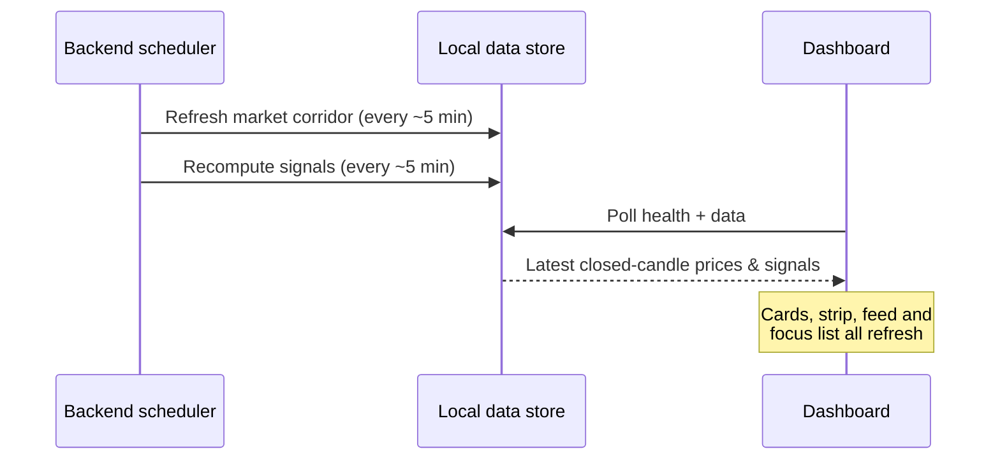

# 4. Dashboard

[← Getting started](03-getting-started.md) · [Contents](README.md) · [Next: Watchlist →](05-watchlist.md)

---

The Dashboard is your **cross‑market command centre**. It answers four questions at a glance: _What's the regime? How am I positioned? Where are the signals? What's leading?_

  

---

## The daily brief

The first thing under the heading is the **AI daily brief** — a narrated
morning read of the engine's own facts: which regimes dominate, the strongest
current signals, and any risk warnings. Its source chip tells you whether your
configured model or the deterministic template wrote it, and it renders a
loading or unavailable state rather than disappearing
(see [AI features](18-ai-features.md)).

## The summary cards

The four cards across the top give an instant read on your situation.

| Card               | What it tells you                                                                                                               |
| ------------------ | ------------------------------------------------------------------------------------------------------------------------------- |
| **Paper Balance**  | Your simulated account value and number of open paper positions.                                                                |
| **Realized P&L**   | Cumulative profit/loss from closed paper trades since inception.                                                                |
| **Market Regime**  | A derived read of overall conditions — e.g. _Risk‑On / Trending_, _Mixed / Rotational_ — based on the current signal inventory. |
| **Active Signals** | How many closed‑candle signals are currently live across all tracked symbols.                                                   |

> The **Market Regime** label is a summary of the backend's current signals, not a separate forecast. It helps you calibrate how aggressive or defensive the broad tape is. See [Core concepts → Market regime](11-core-concepts.md#market-regime).

---

## Market overview strip

The **Market Overview Strip** shows compact cards for the headline instruments (BTC, ETH, SOL, LINK, SPY, QQQ and more). Each card displays:

- **Last price** and **percent change** (green = up, red = down).
- **Source and timeframe** of the candles (e.g. _LIVE 1H VIA CCXT_COINBASE_, _LIVE 1D VIA YAHOO_PUBLIC_).
- A **mini sparkline** of recent price action.
- A **diagnostics** note describing data integrity (e.g. _partial_latest_candle_excluded_, _gaps_detected_) — this is how the app stays honest about closed‑candle‑only data.

### Refresh corridor

The **Refresh corridor** button forces the backend to re‑pull the latest closed candles for the tracked "market corridor" of instruments. Use it if you want the freshest data immediately rather than waiting for the scheduled refresh.

---

## Paper account snapshot

Open positions include a **Close** button (exit at the latest closed price);
the full trading desk — working orders, partial close, the closure ledger —
lives on the [Portfolio screen](17-portfolio.md).

On the right, the **Paper Account Snapshot** lists your open simulated positions with their side (LONG/SHORT), size, average entry price, and current unrealized value. This mirrors the data you act on from the [Symbol detail](07-symbol-detail.md) and [Signals](06-signals.md) screens. Learn how execution works in [Paper vs live trading](12-paper-trading.md).

---

## Latest signals feed

The **Evidence‑based signal feed** shows the most recent signals as cards. Each card carries:

- **Symbol** and **timeframe** (e.g. _BTC/USD · 15m_).
- **Signal label** — `BUY_ZONE`, `SELL`, `HOLD`, `WAIT` or `WATCH` (see [Core concepts](11-core-concepts.md#the-signal-types)).
- **Confidence ring** — the evidence‑based score; low‑confidence setups are visually de‑emphasised.
- **R:R** — the planned reward‑to‑risk ratio.
- Quick actions: **Open symbol**, **View signal** (opens the full drawer), and **Backtest**.

> Cards for low‑confidence or invalidated signals are intentionally dimmed so your eye is drawn to the strongest, freshest setups.

---

## Watchlist snapshot

The **Focus list** on the right is a compact view of your watchlist: symbol, last price, change, a sparkline and the current signal chip (`WAIT`, `WATCH`, `HOLD`, `BUY ZONE`…). Click any row to open its [Symbol detail](07-symbol-detail.md). Manage the full list on the [Watchlist](05-watchlist.md) screen.

---

## How the Dashboard updates

You don't need to do anything to keep the Dashboard current — the backend refreshes data on a schedule, and the UI reflects it. Use **Refresh corridor** only when you want an immediate update.

---

[← Getting started](03-getting-started.md) · [Contents](README.md) · [Next: Watchlist →](05-watchlist.md)
