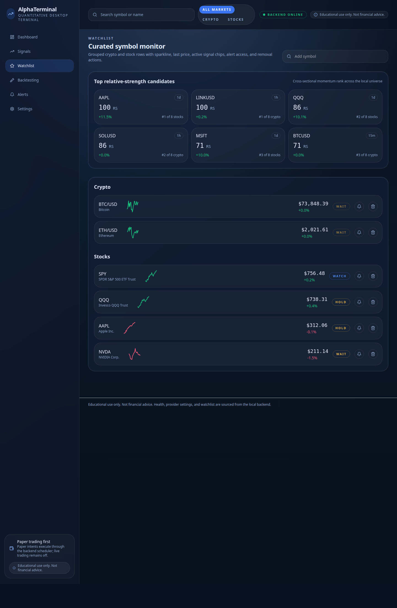
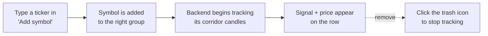

# 5. Watchlist

[← Dashboard](04-dashboard.md) · [Contents](README.md) · [Next: Signals →](06-signals.md)

---

The Watchlist is your **curated symbol monitor**. It groups the instruments you care about, shows their live state, and — crucially — ranks them by **relative strength** so you can quickly see what's leading and what's lagging.

  

---

## Top relative‑strength candidates

At the top, AlphaTerminal ranks your universe by **cross‑sectional momentum** — that is, how each symbol is performing *relative to its peers*, not just on its own.

Each candidate chip shows:

| Field | Meaning |
|-------|---------|
| **Symbol** & **timeframe** | e.g. *AAPL · 1d* |
| **RS score** | Relative‑strength score from 0–100. |
| **Trailing return** | The recent momentum (e.g. *+11.8%*). |
| **Rank** | Position within its group, e.g. *#1 of 8 stocks*. |

> Crypto and stocks are ranked **separately** (a percentile within each market type), because their volatility profiles differ. A 100 RS crypto name and a 100 RS stock are each the leader of their own group. See [Core concepts → Relative strength](11-core-concepts.md#relative-strength-ranking).

Click any candidate to jump straight to its [Symbol detail](07-symbol-detail.md).

---

## The grouped symbol list

Below the ranking, your watched symbols are grouped by asset class (**crypto**, **stocks**). Each row shows:

- **Ticker and name** (e.g. *BTC/USD — Bitcoin*).
- **Last price** and **percent change**.
- The current **signal chip** (`BUY ZONE`, `HOLD`, `WAIT`, …).
- An **alert** button (bell) to create an alert for that symbol.
- A **remove** button to drop it from the watchlist.

Clicking the ticker opens the full [Symbol detail](07-symbol-detail.md) screen.

---

## Adding and removing symbols

- **Add:** type a ticker into the **Add symbol** box (e.g. `MSFT` or `SOLUSD`) and confirm. AlphaTerminal starts tracking its closed‑candle data and computing signals.
- **Remove:** click the **remove** (trash) icon on a row, or use **Remove from watchlist** on the symbol's detail screen.

> The default build exposes **US‑compliant venues only**. Crypto pairs resolve via Coinbase/Kraken/Gemini; equities via Yahoo Finance (and any paid providers you configure). See [Settings → Providers](10-settings.md#providers).

---

## How to use the Watchlist effectively

1. **Lead with relative strength.** In an uptrend, favour the top‑ranked names; in a downtrend, the bottom‑ranked are the weakest.
2. **Watch the signal chips.** A `BUY ZONE` on a high‑RS symbol is a stronger confluence than the same signal on a laggard.
3. **Set alerts on the candidates you can't watch all day** — the bell icon creates one in two clicks. ([Alerts](09-alerts.md))

---

[← Dashboard](04-dashboard.md) · [Contents](README.md) · [Next: Signals →](06-signals.md)
