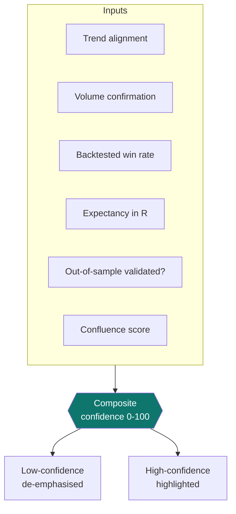

# 6. Signals

[← Watchlist](05-watchlist.md) · [Contents](README.md) · [Next: Symbol detail →](07-symbol-detail.md)

---

The Signals screen is the **filterable inventory** of every signal QuantGlass currently has — across all symbols, timeframes and setups. It's where you go to scan for opportunities that match your criteria.

  

---

## The signal types

Every signal carries one of five labels. They describe the **current state**, not a promise of the future.

| Label | Colour cue | Meaning |
|-------|-----------|---------|
| `BUY_ZONE` | Green | Price is in a defined entry zone for a long setup, with a stop and targets attached. |
| `SELL` | Red | A short/exit setup is active. |
| `HOLD` | Neutral | A position thesis remains valid; no new action. |
| `WAIT` | Amber | Conditions are forming but the trigger hasn't been met — stand by. |
| `WATCH` | Blue | On the radar; monitor for a setup to develop. |

Each signal also has a **status**: `active`, `invalidated` (the setup's conditions broke) or `closed`. Invalidated signals are shown dimmed.

> A full explanation of how these are derived — indicators, regime and setup families — is in [Core concepts](11-core-concepts.md).

---

## Filtering

Use the filter controls to narrow the inventory:

| Filter | What it does |
|--------|--------------|
| **Signal type** | Show only `BUY_ZONE`, `SELL`, `HOLD`, `WAIT` or `WATCH`. |
| **Min confidence** | Hide signals below a confidence threshold (e.g. only ≥ 60%). |
| **Timeframe** | Restrict to `15m`, `1h`, `4h` or `1d`. |
| **Market filter** (top bar) | All Markets / Crypto / Stocks. |

Combine filters to answer questions like *"show me only high‑confidence 1h buy zones in crypto."*

---

## Reading a signal row

Each signal exposes the key decision data at a glance:

- **Symbol · timeframe** — what and when.
- **Setup type** — e.g. *ema reclaim pullback*, *trend rejection breakdown*, *range reset*.
- **Confidence** — the evidence‑based score (see below).
- **Expectancy (R)** — the average reward per unit of risk from the backtest.
- **Status** — active / invalidated / closed.

Click a row to open the **Signal drawer** with the full breakdown, or to route to the [Symbol detail](07-symbol-detail.md) or a pre‑filled [Backtest](08-backtesting.md).

---

## What "confidence" means here

The confidence percentage is **not** a probability that the trade will win. It is a composite score built from measurable evidence:

A signal that is well‑aligned with the trend, confirmed by volume, and backed by a setup with a strong, **out‑of‑sample‑validated** win rate and positive expectancy will score high. One built on a thin backtest sample will score low and be flagged. Full detail: [Core concepts → Confidence](11-core-concepts.md#confidence-how-the-number-is-built).

---

## A disciplined workflow

1. Set **Min confidence** to a level you trust (many users start at 50–60%).
2. Pick a **timeframe** that matches your style (intraday → `15m`/`1h`; swing → `4h`/`1d`).
3. For any promising signal, **open the symbol** to see it on the chart, then **backtest the setup** before acting.
4. If you can't watch it live, **create an alert**.

> Remember: signals are deterministic hypotheses, not advice. Always validate with the backtest and respect the stop. See the standing disclaimer on every screen.

---

[← Watchlist](05-watchlist.md) · [Contents](README.md) · [Next: Symbol detail →](07-symbol-detail.md)
