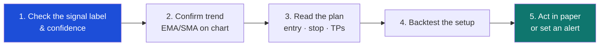

# 7. Symbol detail & charts

[← Signals](06-signals.md) · [Contents](README.md) · [Next: Backtesting →](08-backtesting.md)

---

The Symbol detail screen is the **deep‑dive** view for a single instrument. It pairs a full interactive candlestick chart with a deterministic decision card, supporting indicator panels, and a news/catalyst tape — everything you need to evaluate one symbol on one timeframe.

  

---

## The chart

The main chart is a professional candlestick view (powered by TradingView Lightweight Charts) fed by the backend's **closed‑candle corridor store**. Above it you'll see the data provenance, e.g. *Live backend corridor candles: ccxt_coinbase 1h · latest …*.

### Timeframe selector
Switch between **15M · 1H · 4H · 1D** at the top right. The chart, indicators and signal all recompute for the chosen timeframe.

### Overlay toggles
Toggle analytical overlays on and off:

| Toggle | Shows |
|--------|-------|
| **EMA** | 21‑period exponential moving average (short‑term trend). |
| **SMA** | 50‑period simple moving average (intermediate trend). |
| **Bollinger** | Volatility bands (20, 2σ). |
| **S/R** | Support/resistance zones, plus the active entry, stop and take‑profit lines. |
| **RSI** | Relative Strength Index panel. |
| **MACD** | MACD momentum panel. |
| **ATR** | Average True Range (volatility) panel. |
| **Volume** | Volume panel. |

The chart also draws the **trade plan** directly: the **Entry** zone, **SL** (stop loss) and **TP1/TP2/TP3** (take‑profit ladder) lines, so you can see exactly where the setup expects to act.

### Sub‑panels
Below the chart, dedicated **RSI**, **MACD**, **Volume** and **ATR** panels give you the supporting context. The ATR panel reminds you that *"Volatility regime stays aligned with closed candles only."*

---

## The deterministic decision card

On the right, the **Current signal** card is the heart of the screen. It translates all the analytics into one actionable plan.

| Element | Meaning |
|---------|---------|
| **Signal label** | `BUY ZONE`, `WAIT`, `SELL`, etc. |
| **Confidence** | The evidence‑based score (e.g. *43*), with a warning if low. |
| **EMA 21 / SMA 50** | Trend reference levels. |
| **RSI 14** | Momentum oscillator value. |
| **ATR 14** | Volatility per bar. |
| **Support / Resistance zone** | Rolling 24‑bar floor and ceiling. |
| **Entry zone** | The price band to enter (e.g. *$73,807.83 – $73,861.91*). |
| **Stop** | Where the thesis is invalidated. |
| **TP ladder** | The three scaled take‑profit targets. |
| **Generated …** | The closed‑candle timestamp the signal was computed from. |

### Card actions
- **View full signal** — opens the signal drawer with the complete confidence breakdown and reasons.
- **Run backtest on this setup** — opens [Backtesting](08-backtesting.md) pre‑filled with this symbol, setup and timeframe.
- **Create alert** — opens the alert modal for this symbol. ([Alerts](09-alerts.md))

> Everything on this card is **deterministic**: given the same closed candles, you'll always get the same plan. There is no hidden randomness.

---

## Catalyst tape (news)

The **Recent news** / **Catalyst tape** panel shows headlines relevant to the symbol. When a live news provider is configured, these are real articles; otherwise the app shows clearly‑labelled **derived** notes generated from the local market data (e.g. *"Derived from local market data — not live news"*). This keeps the feed honest about its source. Configure a news provider under [Settings → API Keys](10-settings.md#api-keys).

---

## Volume context

A small **Volume context** block confirms the closed‑candle discipline: latest closed‑bar volume and the number of candles in the analysis window. No partial bars are ever included.

---

## Recommended reading order on this screen

---

[← Signals](06-signals.md) · [Contents](README.md) · [Next: Backtesting →](08-backtesting.md)
