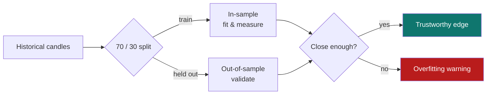

# 8. Backtesting

[← Symbol detail](07-symbol-detail.md) · [Contents](README.md) · [Next: Alerts →](09-alerts.md)

---

The Backtesting screen exists to keep you honest. It re‑runs a setup over historical closed candles, applies realistic **fees and slippage**, and separates **in‑sample** (training) from **out‑of‑sample** (held‑out) performance — then warns you when the sample is too small to trust.

  

---

## Inputs

| Control | What it does |
|---------|--------------|
| **Strategy / setup selector** | Choose a symbol + setup (e.g. *AAPL Trend Hold Continuation*, *BTC/USD Ema Reclaim Pullback*). |
| **Fees %** | Per‑trade commission assumption (e.g. 0.02%). |
| **Slippage %** | Expected execution slippage (e.g. 0.01%). |
| **Train / test split** | The in‑sample vs out‑of‑sample boundary (default **70% train / 30% test**). |
| **Walk‑forward analysis** | When enabled, validates across rolling windows rather than a single split. |

Changing any input **re‑runs the backend quant engine** against the stored corridor candles, so the metrics below always reflect your assumptions.

> The **Prefill source** box tells you exactly what's being tested (symbol, setup, timeframe) and whether live market‑corridor data backs it.

---

## Metrics

The results panel reports a full statistics suite.

| Metric | What it measures | How to read it |
|--------|------------------|----------------|
| **Net win rate** | % of trades that were profitable after costs. | Higher is better, but always check the sample size. |
| **Average R** | Average reward per trade in **R** (multiples of risk). | > 0 means the setup made money per trade on average. |
| **Expectancy** | Expected R per trade. | The single best summary of edge. |
| **Max drawdown** | Worst peak‑to‑trough equity decline. | Lower is better; gauges pain. |
| **Sharpe** | Risk‑adjusted return. | Higher is better. |
| **Sortino** | Downside‑risk‑adjusted return. | Higher is better; penalises losses only. |
| **Profit factor** | Gross wins ÷ gross losses. | > 1 is profitable; > 1.5 is strong. |
| **Trade count** | Number of trades in the test. | The credibility multiplier — see below. |

An **equity curve** and **drawdown curve** visualise the same data over time.

---

## In‑sample vs out‑of‑sample

This is the most important section for avoiding self‑deception.

- **In‑sample win rate** — performance on the training segment.
- **Out‑of‑sample win rate** — performance on data the setup never "saw".

If the two are **close**, the edge is more likely real. If in‑sample looks great but out‑of‑sample collapses, the app flags **overfitting** — the setup was tuned to noise.

---

## The low‑sample warning

> ⚠️ *"This setup has fewer than 50 trades, so the validation statistics should be treated as unstable."*

QuantGlass applies a **minimum sample threshold (50 trades by default)**. Below it, even a 100% win rate is treated as **unreliable**, not impressive. This is deliberate: small samples produce flattering but meaningless numbers. Confidence scores elsewhere in the app also down‑weight under‑sampled setups.

---

## Saving a strategy

Click **Save strategy** to store the configured setup (with its fees, slippage and split). Saved strategies appear under [Settings → Strategies](10-settings.md#strategies) and can be reused.

---

## A trustworthy backtest checklist

1. **Trade count ≥ 50** — otherwise treat results as exploratory only.
2. **Out‑of‑sample ≈ in‑sample** — no overfitting flag.
3. **Expectancy > 0** and **profit factor > 1** after fees and slippage.
4. **Drawdown** you could actually tolerate.
5. Re‑run with **walk‑forward** for an extra robustness check.

---

[← Symbol detail](07-symbol-detail.md) · [Contents](README.md) · [Next: Alerts →](09-alerts.md)
