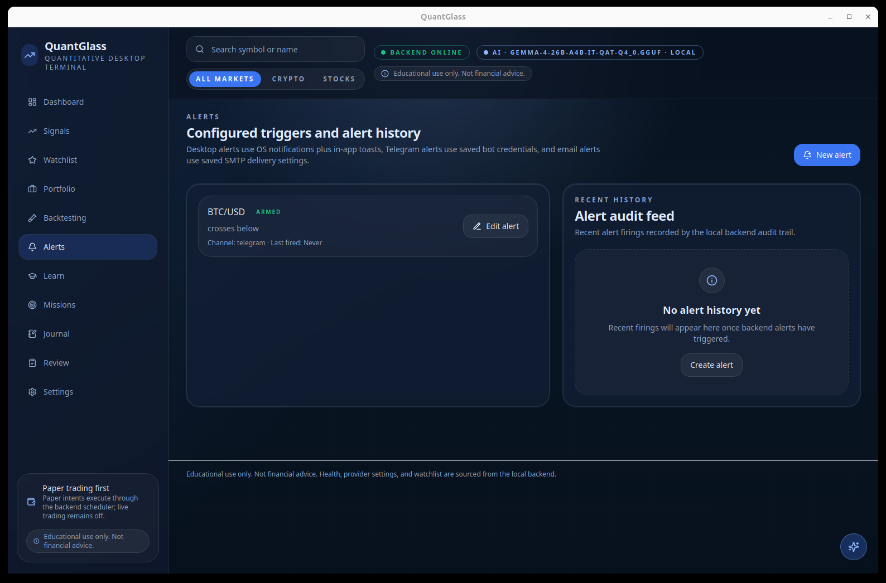
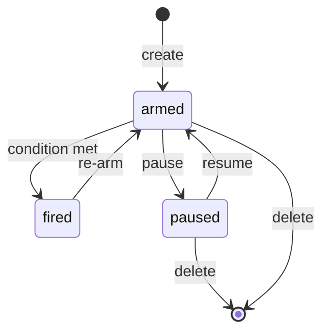

# 9. Alerts

[← Backtesting](08-backtesting.md) · [Contents](README.md) · [Next: Settings →](10-settings.md)

---

Alerts notify you when a condition you care about is met, so you don't have to stare at charts. QuantGlass evaluates alerts on the backend every minute and can deliver them via **desktop notification**, **Telegram**, or **email**.

  

---

## Delivery channels

| Channel | How it works | Setup required |
|---------|--------------|----------------|
| **Desktop** | A local OS notification plus the in-app alert toast. | Allow OS notification permission when prompted. |
| **Telegram** | A message from your bot to your chat. | Bot token + chat ID in [Settings → API Keys](10-settings.md#api-keys). |
| **Email** | An email via your SMTP server. | SMTP host, port and credentials in [Settings → API Keys](10-settings.md#api-keys). |

> You can send a **test notification** for any channel from [Settings → API Keys](10-settings.md#api-keys) to confirm delivery before relying on it. Desktop tests request OS permission through the desktop shell; Telegram and email tests use the saved backend credentials.

---

## Creating an alert

You can create an alert from several places:

- The **New alert** button on the Alerts screen.
- The **bell icon** on any [Watchlist](05-watchlist.md) row.
- **Create alert** on the [Symbol detail](07-symbol-detail.md) decision card.

An alert has:

| Field | Example |
|-------|---------|
| **Symbol** | `BTC/USD` |
| **Condition** | A price/level rule (e.g. crosses above resistance, signal becomes `BUY_ZONE`). |
| **Channel** | desktop / telegram / email |
| **Status** | `armed`, `paused`, or `fired` |

---

## Alert lifecycle

- **armed** — actively evaluated every minute by the backend.
- **paused** — kept but not evaluated.
- **fired** — the condition was met; delivery is attempted and the firing is recorded in history. If Telegram or email delivery fails, the app shows the failure reason.

Edit or pause an alert with the **Edit alert** button on its card.

---

## Alert history

The **Alert audit feed** records every firing with its timestamp, so you have a permanent, local audit trail of what triggered and when. When no alerts have fired yet, the panel shows an empty state inviting you to create one.

---

## Tips

1. **Start with desktop alerts** — zero external configuration after OS notification permission is allowed.
2. **Use Telegram for mobile reach** when you're away from the machine.
3. **Reserve email** for lower‑urgency or archival notifications.
4. Always **send a test** after configuring Telegram or email so you know delivery works.

> Alerts are evaluated by the bundled backend while QuantGlass is running. They are part of the local‑first design — nothing about your alerts is stored in the cloud.

---

[← Backtesting](08-backtesting.md) · [Contents](README.md) · [Next: Settings →](10-settings.md)
