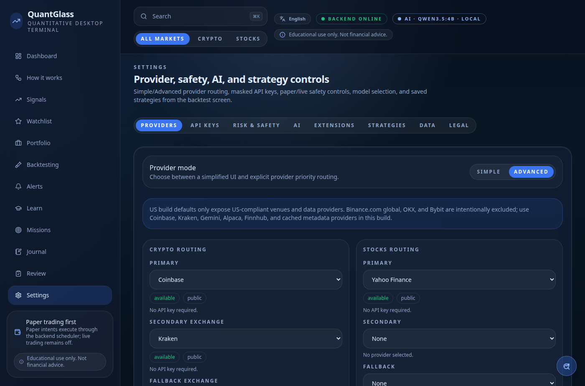
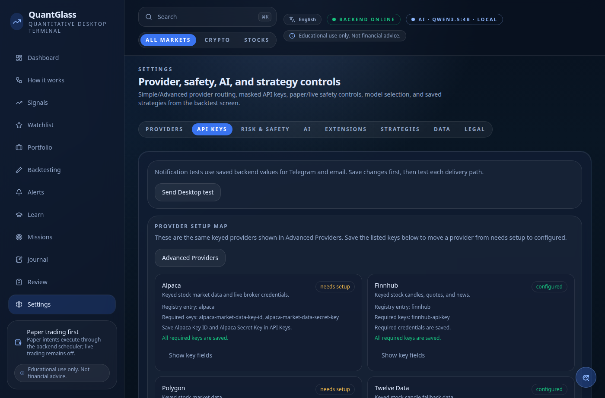
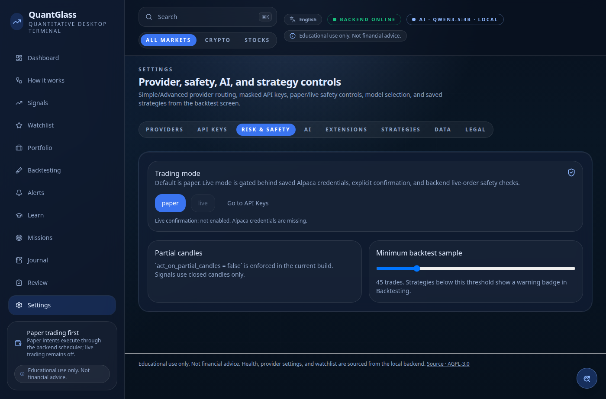
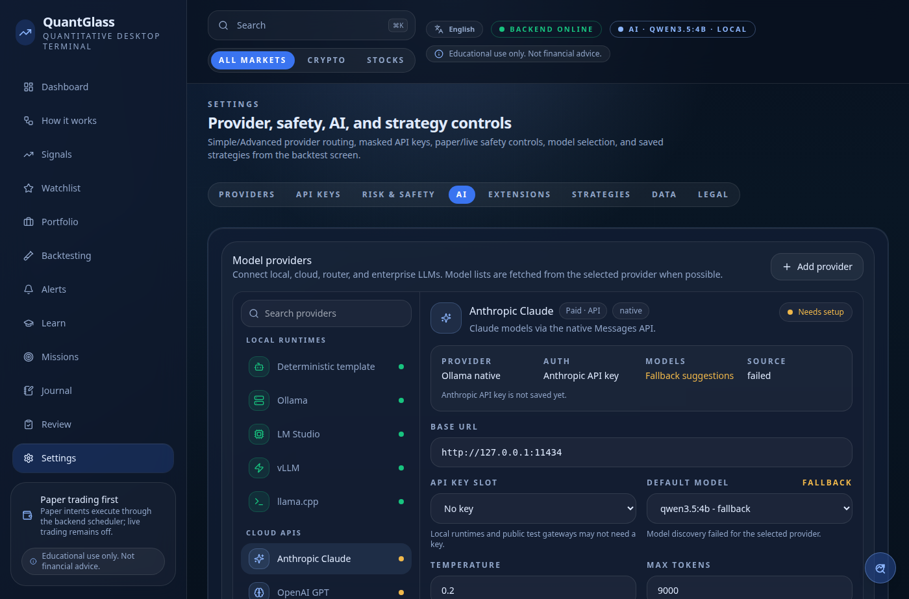

# 10. Settings

[← Alerts](09-alerts.md) · [Contents](README.md) · [Next: Core concepts →](11-core-concepts.md)

---

Settings is where you control **data providers, API keys, risk/safety, AI narration, extensions, and saved strategies**.

<p align="center">
  
</p>

| Tab | Purpose |
|-----|---------|
| [Providers](#providers) | Which data sources are used and in what priority. |
| [API Keys](#api-keys) | Encrypted keys for paid providers and notification channels. |
| [Risk & Safety](#risk--safety) | Paper/live mode, partial candles, minimum backtest sample. |
| [AI](#ai) | Local/API narration model selection. |
| [Extensions](#extensions) | Installed extension registry and loading status. |
| [Strategies](#strategies) | Strategies you saved from Backtesting. |

---

## Providers

QuantGlass routes each data domain (crypto, stocks, news, AI, trading) through a **priority chain**: a primary source, then a secondary, then a fallback.

- **Simple mode** picks sensible US‑compliant defaults for you:
  - **Crypto:** Coinbase → Kraken → Gemini.
  - **Stocks:** Yahoo Finance.
  - **AI:** Template fallback with optional Ollama/local/API gateway narration.
  - **Trading:** Paper only.
- **Advanced mode** exposes explicit primary/secondary/fallback routing and per‑market rate limits.

The **Provider registry status** list shows each provider, its capabilities (`ohlcv`, `order_book`, `news`, `trading`, `ai`), its transport (`public`, `keyed`, `internal`) and whether it is `configured` or `needs setup`.

> **US‑compliance note:** the default build intentionally **excludes** Binance.com global, OKX and Bybit. It uses Coinbase, Kraken, Gemini, Alpaca, Finnhub and cached metadata providers.

---

## API Keys

<p align="center">
  
</p>

Add optional keys to unlock paid data and notification channels. Keys are **masked** in the UI and **encrypted at rest**.

| Key | Unlocks |
|-----|---------|
| **Finnhub** | News and additional equity data. |
| **Polygon / Twelve Data** | Additional equity OHLCV. |
| **Alpaca** | Equity data and (with live unlock) paper/live trading. |
| **Telegram bot token + chat ID** | Telegram alert delivery. |
| **SMTP host/port/credentials** | Email alert delivery. |
| **OpenAI / OpenAI-compatible API keys** | Optional hosted or private model gateway narration. |

> **Security:** ordinary keys are encrypted on disk. **Trade‑enabled** credentials are additionally stored in your operating system's keychain. See [Technical → Security model](../technical/09-security.md) for details. Use the per‑channel **test** buttons to verify notifications.

---

## Risk & Safety

<p align="center">
  
</p>

| Control | Default | Meaning |
|---------|---------|---------|
| **Trading mode** | `paper` | Switch between paper and live. Live requires explicit confirmation; only paper execution is active by default. |
| **Partial candles** | `false` (enforced) | Signals use **closed candles only**; partial bars are never acted on. |
| **Minimum backtest sample** | `50` trades | Strategies below this threshold show an instability warning in Backtesting. |

> The live‑trading switch is a **deliberate safety gate**. Flipping to live requires confirmation and trade‑enabled keys. Read [Paper vs live trading](12-paper-trading.md) before changing it.

---

## AI

<p align="center">
  
</p>

Controls how signal explanations ("narration") are generated.

| Setting | Default | Notes |
|---------|---------|-------|
| **Provider** | `ollama` | Template, Ollama, LM Studio, OpenAI, or OpenAI-compatible. |
| **Model** | `qwen3:14b-q4_K_M` | Provider model id used for narration. |
| **Base URL** | `http://127.0.0.1:11434` | Ollama native endpoint or OpenAI-compatible `/v1` endpoint. |
| **API key** | None | Optional stored key for OpenAI or private gateways. |
| **Cloud narration** | Off | Kept off by default to preserve the local‑first hot path. |
| **Request timeout** | 8 s | Narration falls back to a template if the model is slow. |

If the configured model server isn't running, QuantGlass automatically uses **template‑based** explanations — every signal still gets a clear, fact‑checked write‑up. See [Core concepts → AI narration](11-core-concepts.md#ai-narration-and-the-fact-guard).

Common local presets:

- Ollama native: `provider=ollama`, `baseUrl=http://127.0.0.1:11434`.
- Ollama OpenAI-compatible: `provider=openai_compatible`, `baseUrl=http://127.0.0.1:11434/v1`.
- LM Studio: `provider=lm_studio`, `baseUrl=http://127.0.0.1:1234/v1`.
- OpenAI: `provider=openai`, `baseUrl=https://api.openai.com/v1`, `apiKeyId=openai-api-key`.
- Custom gateways: `provider=openai_compatible` with the gateway's `/v1` base URL.

---

## Extensions

The Extensions tab shows backend extension manifests, requested permissions,
settings schema, health, and diagnostics. External Python extensions are disabled
by default because installed packages execute code inside the backend process.
Use the extension enable toggle and settings controls to persist configuration;
enable/disable changes take effect after restarting the backend.

Enable extension entry points only for packages you trust:

```bash
QUANTGLASS_ENABLE_EXTENSION_ENTRY_POINTS=true npm run backend:dev
```

Extensions can contribute provider adapters, AI gateways, indicators, strategies,
backtest assumptions, broker adapters, notification channels, import/export
flows, data-quality checks, or performance optimizations. See
[Contributing → Extensions](../contributing/extensions.md).

---

## Strategies

The Strategies tab lists every strategy you saved from the [Backtesting](08-backtesting.md) screen, with its setup type, timeframe, cost assumptions and headline metrics. Reuse them as starting points for further analysis.

---

[← Alerts](09-alerts.md) · [Contents](README.md) · [Next: Core concepts →](11-core-concepts.md)
