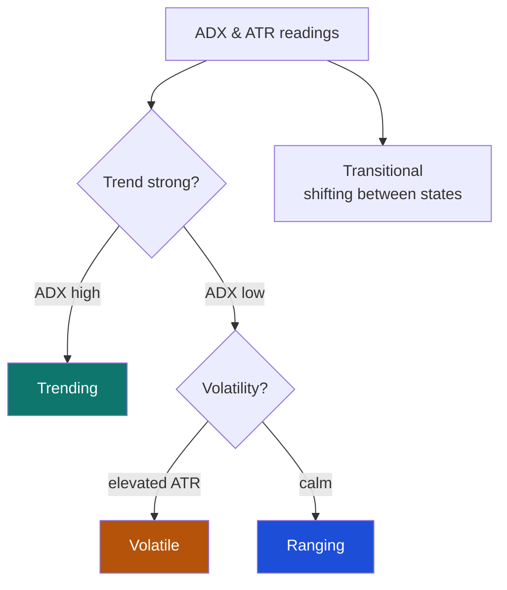
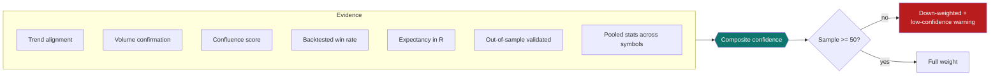

# 11. Core concepts

[← Settings](10-settings.md) · [Contents](README.md) · [Next: Paper vs live trading →](12-paper-trading.md)

---

This chapter explains the ideas behind QuantGlass so the numbers on every screen mean something to you. None of it is advice — it's how the engine reasons.

---

## Closed candles and "no repainting"

A **candle** summarises price over a fixed interval (open, high, low, close). QuantGlass computes signals **only when a candle closes**. A live, still‑forming bar is excluded. This guarantees a signal won't appear and then disappear as the current bar fluctuates — a problem called **repainting**. You'll see _"Closed‑candle only"_ and diagnostics like _partial_latest_candle_excluded_ as proof of this discipline.

---

## The signal types

| Label      | Meaning                                                                                |
| ---------- | -------------------------------------------------------------------------------------- |
| `BUY_ZONE` | Price is inside a defined long entry band; a stop and take‑profit ladder are attached. |
| `SELL`     | A short/exit setup is active.                                                          |
| `HOLD`     | An existing thesis remains valid; no new action.                                       |
| `WAIT`     | Conditions are forming; the trigger hasn't fired yet.                                  |
| `WATCH`    | On the radar; monitor for a setup to develop.                                          |

Each signal also carries a **risk level** (low/medium/high) and a full **trade plan**: entry zone, stop loss, a three‑rung take‑profit ladder, and the resulting **risk‑reward (R:R)** ratio.

---

## The indicators

The engine computes a standard quantitative toolkit on each symbol/timeframe:

| Indicator                    | Role                                            |
| ---------------------------- | ----------------------------------------------- |
| **EMA 21**                   | Short‑term trend.                               |
| **SMA 50**                   | Intermediate trend baseline.                    |
| **RSI 14** (and fast RSI)    | Momentum / overbought‑oversold.                 |
| **MACD (12, 26, 9)**         | Trend‑momentum and crossovers.                  |
| **ATR 14**                   | Volatility per bar (used for stops and regime). |
| **ADX 14**                   | Trend strength (drives regime detection).       |
| **Bollinger Bands (20, 2σ)** | Volatility envelope / mean‑reversion context.   |
| **Keltner Channels**         | Volatility envelope (ATR‑based).                |
| **Donchian (20)**            | Breakout reference (rolling highs/lows).        |

---

## Market regime

Before choosing a setup, the engine classifies the **regime** — the character of the market — primarily from **ADX** (trend strength) and **ATR** (volatility):

| Regime           | Character                 | Setups it favours                 |
| ---------------- | ------------------------- | --------------------------------- |
| **Trending**     | Strong directional move.  | Pullbacks and continuations.      |
| **Ranging**      | Sideways, mean‑reverting. | Fades at the edges of the range.  |
| **Volatile**     | Large, erratic swings.    | Breakout/retest with wider stops. |
| **Transitional** | Shifting between states.  | Caution; lower confidence.        |

The Dashboard's **Market Regime** card summarises the dominant regime across the current signal inventory.

---

## Setup families

The engine matches the regime to a family of trade setups, for example:

- **Trend pullback / continuation** — buy strength dips in an uptrend (e.g. _EMA reclaim pullback_).
- **Trend rejection / breakdown** — fade failed pushes (e.g. _trend rejection breakdown_).
- **Breakout / breakdown retest** — trade confirmed breaks of Donchian levels.
- **Mean reversion / range reset** — fade extremes inside a range.
- **Momentum confirmation** — act when momentum and trend agree.

The specific setup is shown as the **setup type** on signals and the symbol detail card.

---

## Confidence: how the number is built

Confidence is the app's headline trust score (0–100). It is **assembled from evidence**, not guessed:

| Ingredient                  | Why it matters                                   |
| --------------------------- | ------------------------------------------------ |
| **Trend alignment**         | Is the setup with or against the dominant trend? |
| **Volume confirmation**     | Is the move backed by participation?             |
| **Confluence score**        | How many independent factors agree.              |
| **Backtested win rate**     | How often this exact setup worked historically.  |
| **Expectancy (R)**          | The average reward per unit of risk.             |
| **Out‑of‑sample validated** | Did the edge hold on data it never saw?          |
| **Pooled statistics**       | Robustness across similar setups/symbols.        |

> A high confidence means _the evidence is strong_, not that the trade is guaranteed. Under‑sampled setups are automatically penalised and flagged with a **low‑confidence warning**.

---

## Backtesting, in-sample vs out-of-sample, and R

- **R** is your unit of risk. A trade risking \$100 that makes \$180 is **+1.8R**. **Expectancy** is the average R per trade — the cleanest measure of edge.
- **In‑sample** = the training portion of history; **out‑of‑sample** = a held‑out portion the setup never saw. Edges that survive out‑of‑sample are more trustworthy.
- Backtests include **fees and slippage** and use a **three‑rung take‑profit ladder** (scaling out), so results approximate realistic execution.

Full walkthrough: [Backtesting](08-backtesting.md).

---

## Relative strength ranking

Relative strength compares each symbol's recent performance **against its peers**, blending several trailing‑return windows into a single 0–100 score and a percentile **within its market type** (crypto vs stocks ranked separately). The leaders of each group surface at the top of the [Watchlist](05-watchlist.md). It answers _"what is strong right now?"_ rather than _"is this going up?"_.

---

## AI narration and the fact-guard

For each signal, QuantGlass writes a plain‑language explanation. There are two sources:

1. **Local AI (Ollama)** — when configured, a local language model writes the narration. No data leaves your machine.
2. **Template** — a deterministic, rules‑based write‑up used when AI is unavailable or too slow.

Crucially, every AI narration passes through a **fact‑guard**: if the model states a number that doesn't match the engine's actual figures (within a tight tolerance), that claim is **rejected** and replaced with the verified template text. The narration's origin is always labelled (e.g. _template_, _template‑guarded_, or the model name). This prevents the AI from "hallucinating" prices or stats. Configure it in [Settings → AI](10-settings.md#ai).

---

[← Settings](10-settings.md) · [Contents](README.md) · [Next: Paper vs live trading →](12-paper-trading.md)
