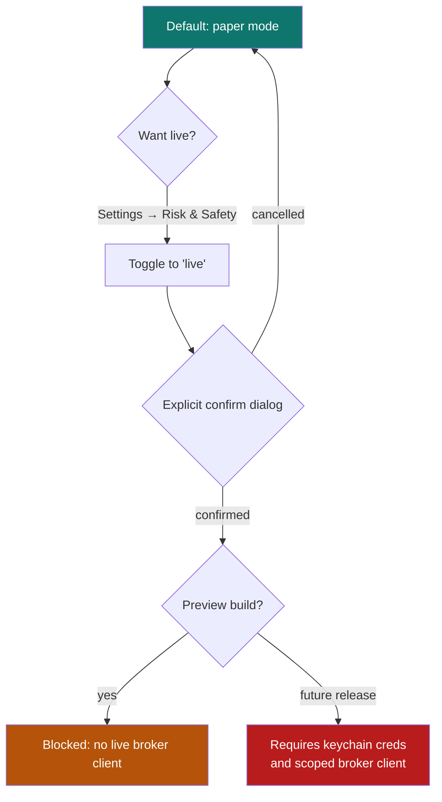

# 12. Paper vs live trading

[← Core concepts](11-core-concepts.md) · [Contents](README.md) · [Next: Backup & recovery →](13-backup-recovery.md)

---

QuantGlass can **simulate** trades (paper) and is designed to eventually
**execute** them at a connected broker (live). The public preview supports
**paper trading as the built-in execution path**; live execution remains blocked
until broker execution, enforced OS-keychain credential storage, and safety gates
are complete.

> **Default state:** *Paper trading only.* You cannot place a real order from the public preview.

---

## Paper trading

Paper trading executes simulated orders through the backend scheduler against closed‑candle prices. It maintains a realistic account:

| Concept | Meaning |
|---------|---------|
| **Balance** | Simulated cash. |
| **Buying power** | What you can deploy. |
| **Open positions** | Side (long/short), size, average entry, unrealized P&L. |
| **Realized P&L** | Cumulative result of closed paper trades. |

You can see this on the [Dashboard](04-dashboard.md) (Paper Balance, Realized P&L, Paper Account Snapshot). Paper trades let you test a strategy's behaviour with **zero financial risk**.

---

## The future live‑trading safety gate

Before live execution can be enabled in a future release, QuantGlass must have:

1. A supported broker execution client.
2. Trade-enabled credentials stored in the operating system keychain without
   encrypted-file fallback.
3. Explicit typed confirmation and a clear UI gate.
4. Tests proving paper mode cannot submit real orders.

Until those are complete, use paper trading only.

---

## Which is right for you?

| Use paper when… | Consider live when… |
|------------------|---------------------|
| Learning the app and your strategy. | A future release implements the live gate. |
| Validating backtested setups forward. | You have validated an edge over a meaningful sample. |
| You want zero financial risk. | You fully understand the risks and broker mechanics. |

> Even in live mode, QuantGlass is **not** financial advice and does not guarantee outcomes. Signals are deterministic hypotheses. You remain fully responsible for every order.

---

[← Core concepts](11-core-concepts.md) · [Contents](README.md) · [Next: Backup & recovery →](13-backup-recovery.md)
