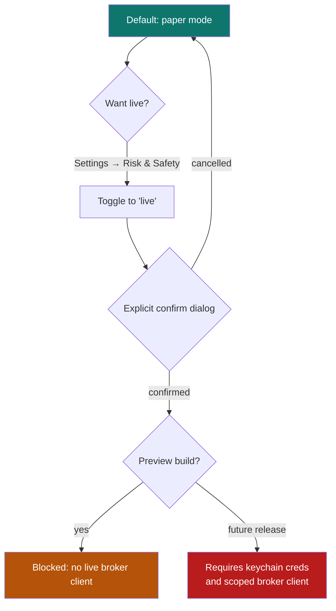

# 12. Paper vs live trading

[← Core concepts](11-core-concepts.md) · [Contents](README.md) · [Next: Backup & recovery →](13-backup-recovery.md)

---

QuantGlass can **simulate** trades (paper) and is designed to eventually
**execute** them at a connected broker (live). The public preview supports
**paper trading as the built-in execution path**; live execution remains blocked
until broker execution, enforced OS-keychain credential storage, and safety gates
are complete.

> **Default state:** _Paper trading only._ You cannot place a real order from the public preview.

---

## Paper trading

Paper trading executes simulated orders through the backend scheduler against closed‑candle prices. It maintains a realistic account:

| Concept            | Meaning                                                 |
| ------------------ | ------------------------------------------------------- |
| **Balance**        | Simulated cash.                                         |
| **Buying power**   | What you can deploy.                                    |
| **Open positions** | Side (long/short), size, average entry, unrealized P&L. |
| **Realized P&L**   | Cumulative result of closed paper trades.               |

You can see this on the [Dashboard](04-dashboard.md) (Paper Balance, Realized P&L, Paper Account Snapshot). Paper trades let you test a strategy's behaviour with **zero financial risk**.

### What the venue executes

The venue supports the full order lifecycle on closed-candle semantics: market,
limit and stop entries; Day / GTC / GTD time in force; trailing stops that
ratchet from the best closed price; your plan's stop and target acting as a
live OCO bracket; cancel for working orders; and full or partial closes. Every
exit lands in the **closure ledger** with PnL and R-multiple. The day-to-day
controls live on the [Portfolio screen](17-portfolio.md).

Two account rules are enforced rather than fudged: orders above buying power
are **rejected** (with the maximum affordable size), and opposing positions
must be closed first — the venue does not net a long against a short.

---

## The future live‑trading safety gate

Before live execution can be enabled in a future release, QuantGlass must have:

1. A supported broker execution client.
2. Trade-enabled credentials stored in the operating system keychain without
   encrypted-file fallback.
3. Explicit typed confirmation and a clear UI gate.
4. Tests proving paper mode cannot submit real orders.

Until those are complete, use paper trading only.

---

## How the order ticket maps to a real broker

The live path forwards your **whole ticket** — order type, prices, time in
force, and plan stop/target — to the broker client. The mapping for Alpaca
(the reference broker client):

| Ticket                     | Alpaca order                  | Notes                                                                                         |
| -------------------------- | ----------------------------- | --------------------------------------------------------------------------------------------- |
| Market                     | `type: market`                |                                                                                               |
| Limit @ price              | `type: limit` + `limit_price` |                                                                                               |
| Stop @ trigger             | `type: stop` + `stop_price`   | Same trigger semantics as the paper venue.                                                    |
| Plan stop **and** target   | `order_class: bracket`        | Both exit legs rest at the broker.                                                            |
| Plan stop _or_ target only | `order_class: oto`            | Single exit leg attached.                                                                     |
| TIF Day / GTC              | `time_in_force: day / gtc`    |                                                                                               |
| TIF GTD                    | **Refused**                   | Alpaca has no good-till-date; use Day/GTC or cancel manually.                                 |
| Trailing %                 | **Refused**                   | Alpaca cannot attach a trail to an entry; enter first, then place a standalone trailing stop. |

**The honesty rule:** if a broker cannot express part of your ticket, the order
is **rejected with an explanation** — it is never silently downgraded to an
unprotected market order. The same applies to extension-provided broker
clients that only implement the legacy market-order interface.

---

## Which is right for you?

| Use paper when…                       | Consider live when…                                  |
| ------------------------------------- | ---------------------------------------------------- |
| Learning the app and your strategy.   | A future release implements the live gate.           |
| Validating backtested setups forward. | You have validated an edge over a meaningful sample. |
| You want zero financial risk.         | You fully understand the risks and broker mechanics. |

> Even in live mode, QuantGlass is **not** financial advice and does not guarantee outcomes. Signals are deterministic hypotheses. You remain fully responsible for every order.

---

[← Core concepts](11-core-concepts.md) · [Contents](README.md) · [Next: Backup & recovery →](13-backup-recovery.md)
