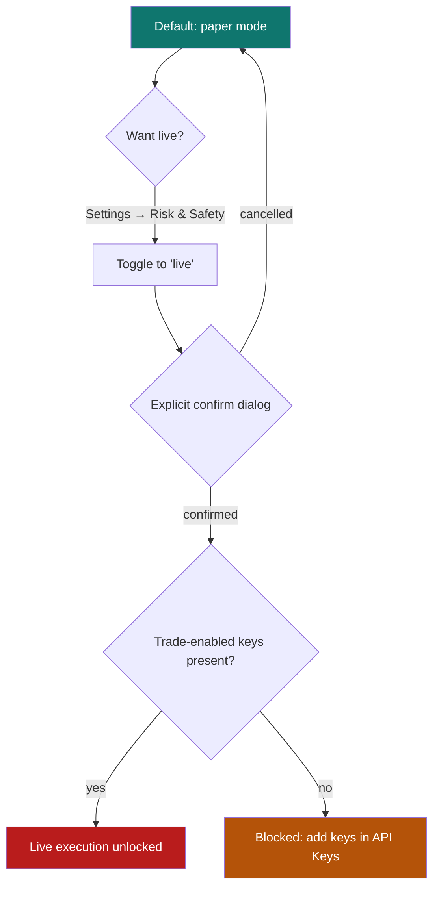

# 12. Paper vs live trading

[← Core concepts](11-core-concepts.md) · [Contents](README.md) · [Next: Backup & recovery →](13-backup-recovery.md)

---

QuantGlass can **simulate** trades (paper) and is designed to eventually **execute** them at a connected broker (live). By default it does **only paper trading**, and live execution is locked behind explicit safety gates.

> ⚠️ **Default state:** *Paper trading first. Live trading remains off.* You cannot place a real order by accident.

---

## Paper trading

Paper trading executes simulated orders through the backend scheduler against closed‑candle prices. It maintains a realistic account:

| Concept | Meaning |
|---------|---------|
| **Balance** | Simulated cash. |
| **Buying power** | What you can deploy. |
| **Open positions** | Side (long/short), size, average entry, unrealized P&L. |
| **Realized P&L** | Cumulative result of closed paper trades. |

You can see this on the [Dashboard](04-dashboard.md) (Paper Balance, Realized P&L, Paper Account Snapshot). Paper trades let you test a strategy's behaviour with **zero financial risk**.

---

## The live‑trading safety gate

To move from paper to live you must:

1. Go to **[Settings → Risk & Safety](10-settings.md#risk--safety)** and switch **Trading mode** to `live`.
2. **Confirm** the explicit dialog acknowledging the risk.
3. Have **trade‑enabled API keys** configured for a supported broker (stored in your OS keychain).

If any step is missing, live execution stays disabled. This multi‑step gate is intentional — it makes enabling real‑money trading a conscious, deliberate act.

---

## Which is right for you?

| Use paper when… | Consider live when… |
|------------------|---------------------|
| Learning the app and your strategy. | You have validated an edge over a meaningful sample. |
| Validating backtested setups forward. | You fully understand the risks and broker mechanics. |
| You want zero financial risk. | You've configured and tested trade‑enabled keys. |

> Even in live mode, QuantGlass is **not** financial advice and does not guarantee outcomes. Signals are deterministic hypotheses. You remain fully responsible for every order.

---

[← Core concepts](11-core-concepts.md) · [Contents](README.md) · [Next: Backup & recovery →](13-backup-recovery.md)
