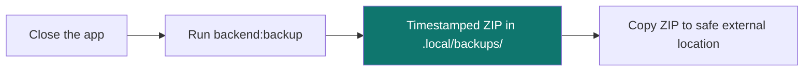

# 13. Backup & recovery

[← Paper vs live trading](12-paper-trading.md) · [Contents](README.md) · [Next: Troubleshooting & FAQ →](14-troubleshooting-faq.md)

---

Because QuantGlass is **local‑first**, everything you create — watchlists, alerts, paper account, saved strategies, encrypted keys and your market history — lives in files on your machine. Backing them up is simply a matter of copying those files (or using the built‑in bundle script).

> For the complete operator reference, see [docs/backup_and_recovery.md](../backup_and_recovery.md).

---

## What gets backed up

| Asset                          | Location (relative to the data folder)         | Contains                                                      |
| ------------------------------ | ---------------------------------------------- | ------------------------------------------------------------- |
| **Operational state** (SQLite) | `state/quantglass.db`                          | Watchlist, alerts, paper account, saved strategies, settings. |
| **Analytics** (DuckDB)         | `analytics/quantglass.duckdb`                  | Market candles, backtest snapshots, expectancy stats.         |
| **Candle archive** (Parquet)   | `parquet/symbol=…/timeframe=…/candles.parquet` | Durable, portable market history.                             |
| **Secrets**                    | `state/secrets/`                               | Encrypted API‑key payload + its decryption key.               |

The **data folder** depends on your OS:

| OS          | Data folder                                |
| ----------- | ------------------------------------------ |
| **Linux**   | `~/.local/share/QuantGlass`                |
| **Windows** | `%APPDATA%\QuantGlass`                     |
| **macOS**   | `~/Library/Application Support/QuantGlass` |

> ⚠️ **The secrets folder is sensitive** — it contains your encrypted keys _and_ the key to decrypt them. Store backups securely and outside the workspace.

---

## Backing up (recommended: the bundle script)



From the project root:

```bash
npm run backend:backup
```

This writes a timestamped ZIP under `.local/backups/` and prints its path. Copy that ZIP somewhere safe (external drive, encrypted storage).

To export to a specific file:

```bash
PYTHONPATH=apps/backend ./.venv/bin/python apps/backend/scripts/manage_state_bundle.py export /absolute/path/to/quantglass-backup.zip
```

### Manual copy

If you prefer, simply **close the app** and copy the entire data folder for your OS (table above) to a safe location.

---

## Restoring

```bash
PYTHONPATH=apps/backend ./.venv/bin/python apps/backend/scripts/manage_state_bundle.py restore /absolute/path/to/quantglass-backup.zip
```

- The restore script automatically writes a **pre‑restore rollback bundle** first, so you can always undo.
- **Restore while the app and backend are not running.**
- If a restore produces unexpected state, use the printed pre‑restore bundle to roll back immediately.

---

## Recovering market history from Parquet

The Parquet partitions are the long‑term archive. If the DuckDB file is ever corrupted, market history can be rebuilt from those partitions — see the rebuild snippet in [docs/backup_and_recovery.md](../backup_and_recovery.md#parquet-candle-archive).

---

[← Paper vs live trading](12-paper-trading.md) · [Contents](README.md) · [Next: Troubleshooting & FAQ →](14-troubleshooting-faq.md)
