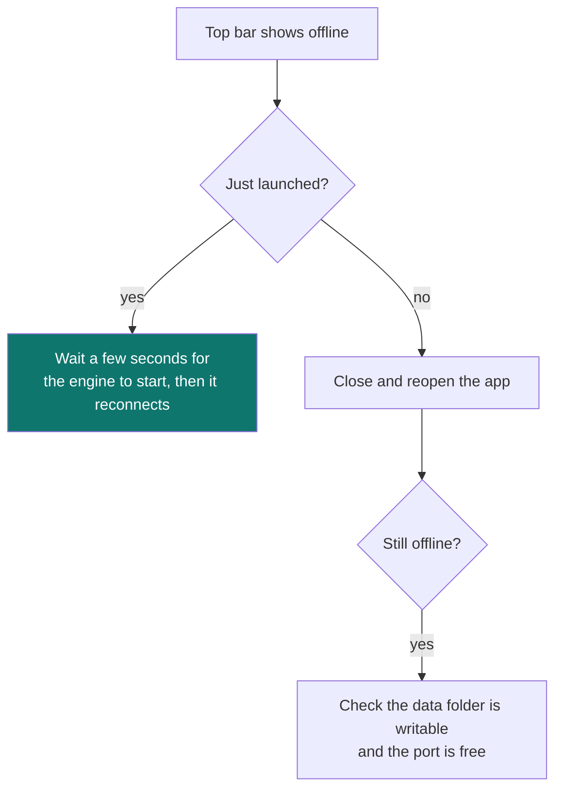

# 14. Troubleshooting & FAQ

[← Backup & recovery](13-backup-recovery.md) · [Contents](README.md) · [Next: Glossary →](15-glossary.md)

---

## Troubleshooting

### Backend shows "unavailable"

The top bar shows **Backend Online** when the bundled engine is reachable, and an _unavailable / offline_ state otherwise.

- **On first launch**, the desktop app starts the local engine and connects to it on a free port. Give it a few seconds; the badge flips to **Backend Online** automatically.
- If it stays offline, **fully quit and relaunch**. The app picks a fresh free port each time.
- Confirm the data folder for your OS is writable (see [Backup & recovery](13-backup-recovery.md)).

### Charts or data look empty / stale

- Data refreshes on a schedule (roughly every few minutes for market data). Right after launch, allow a moment for the first refresh.
- Use the **Refresh corridor** action where available to force an update.
- Remember: only **closed candles** are shown — the current forming bar is intentionally excluded.

### Signals disappeared or changed after a bar closed

That's expected. Signals are recomputed when a candle **closes**. A `WAIT` can become a `BUY_ZONE` (or a signal can be invalidated) on the next close. This is the no‑repaint design, not a bug.

### AI explanations look generic / not from the model

If Ollama isn't running or is slow, narration falls back to the **template** writer and is labelled accordingly. Start your local Ollama server and confirm the model in [Settings → AI](10-settings.md#ai).

### Notifications aren't arriving

- Send a **test** from [Settings → API Keys](10-settings.md#api-keys) for that channel.
- For Telegram, re‑check the bot token and chat ID. For email, re‑check SMTP host/port/credentials.
- Confirm the alert is **armed**, not paused (see [Alerts](09-alerts.md)).

---

## FAQ

**Is QuantGlass financial advice?**
No. It is an educational, quantitative research tool. Signals are deterministic hypotheses, not recommendations. _Educational use only. Not financial advice._

**Does my data go to the cloud?**
No. It runs entirely on your machine. AI narration uses a **local** model by default and cloud narration is off. Only the market/news data you fetch comes from public/keyed providers.

**Can it place real trades by accident?**
No. The public preview is **paper only** with no built-in live broker execution.
See [Paper vs live trading](12-paper-trading.md).

**Which markets and symbols are supported?**
US‑compliant crypto (e.g. BTC, ETH, SOL, LINK via Coinbase/Kraken/Gemini) and US equities/ETFs (e.g. SPY, QQQ, AAPL, MSFT, NVDA, TSLA, COIN, IWM via Yahoo). Binance.com global, OKX and Bybit are intentionally excluded.

**Do I need API keys to use it?**
No — the defaults use public data. Keys only unlock extra providers (news, additional equity data) and notification channels.

**Why is a strategy flagged with a warning in Backtesting?**
Its trade count is below the **minimum backtest sample** (default 50). Small samples are statistically unreliable; treat the metrics with caution.

**What is "R"?**
Your unit of risk per trade. +1R means you made one times what you risked. **Expectancy** is the average R per trade. See [Core concepts](11-core-concepts.md#backtesting-in-sample-vs-out-of-sample-and-r).

**Where is my data stored / how do I move it to a new machine?**
In the OS data folder; copy it or use the backup script. See [Backup & recovery](13-backup-recovery.md).

---

[← Backup & recovery](13-backup-recovery.md) · [Contents](README.md) · [Next: Glossary →](15-glossary.md)
