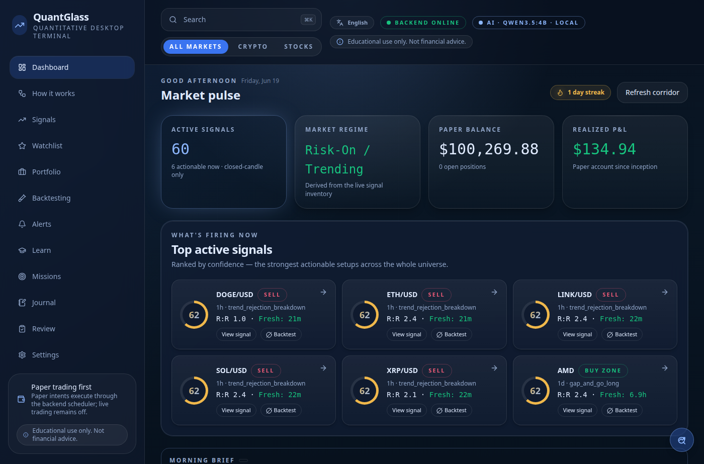
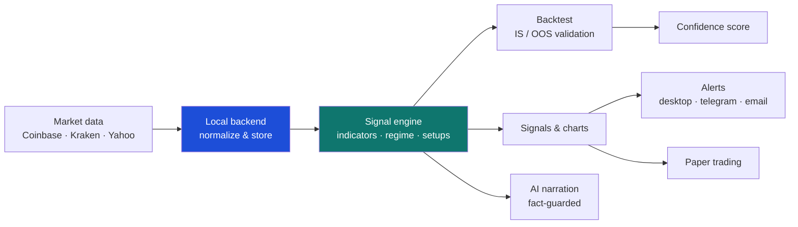

# QuantGlass — User Guide

> **QuantGlass** is a local‑first, single‑user **quantitative desktop terminal** for crypto and US equities. It turns raw market data into **evidence‑based, closed‑candle signals**, lets you **backtest** them honestly, **paper‑trade** them, and **alert** you when conditions trigger — all running privately on your own machine.

  

---

## What this guide covers

This is the **end‑user manual**. It explains how to install, configure and use every screen in the app. If you are a developer who wants to understand how QuantGlass is built, read the [Technical Documentation](../technical/README.md) instead.

| # | Section | What you'll learn |
|---|---------|-------------------|
| 1 | [Introduction](01-introduction.md) | What QuantGlass is, who it's for, and its guiding principles |
| 2 | [Installation](02-installation.md) | Install on Linux, Windows and macOS; system requirements |
| 3 | [Getting started](03-getting-started.md) | First launch, the layout, and a 5‑minute tour |
| 4 | [Dashboard](04-dashboard.md) | Cross‑market overview, regime, paper exposure |
| 5 | [Watchlist](05-watchlist.md) | Curating symbols and relative‑strength ranking |
| 6 | [Signals](06-signals.md) | Reading and filtering the signal inventory |
| 7 | [Symbol detail & charts](07-symbol-detail.md) | The chart, overlays and the decision card |
| 8 | [Backtesting](08-backtesting.md) | Validating a setup with in‑sample / out‑of‑sample stats |
| 9 | [Alerts](09-alerts.md) | Desktop, Telegram and email notifications |
| 10 | [Settings](10-settings.md) | Providers, API keys, risk, AI and strategies |
| 11 | [Core concepts](11-core-concepts.md) | Signals, confidence, regimes, narration explained |
| 12 | [Paper vs live trading](12-paper-trading.md) | The execution model and the live‑trading safety gate |
| 13 | [Backup & recovery](13-backup-recovery.md) | Protecting your data and restoring it |
| 14 | [Troubleshooting & FAQ](14-troubleshooting-faq.md) | Fixing common problems |
| 15 | [Glossary](15-glossary.md) | Every term, indicator and acronym defined |
| 15 | [Academy, Missions & the Feedback Loop](16-academy-and-missions.md) | Every term, indicator and acronym defined |

---

## The 60‑second overview

1. **Data comes in** from public market providers (no keys needed for the defaults).
2. The **backend** normalizes it into closed candles and stores it locally.
3. The **signal engine** computes indicators, detects the market regime, and produces a directional signal with an evidence‑based confidence score.
4. You can **backtest** any setup, watch **charts**, set **alerts**, and run **paper trades**. Real-money live execution is not available in the public preview.

---

## Important: this is not financial advice

> QuantGlass is an **educational and research tool**. Every screen carries the reminder *"Educational use only. Not financial advice."* Signals are deterministic, model‑driven hypotheses — not recommendations. You are responsible for your own decisions. **Live trading is disabled in the public preview**. See [Paper vs live trading](12-paper-trading.md).

---

## Privacy at a glance

- **Local‑first.** All your data — watchlists, strategies, alerts, paper account, candles — lives on your machine.
- **No account, no cloud.** There is no sign‑up and nothing is uploaded by default.
- **You own your keys.** Optional provider API keys are encrypted at rest in local app data. Trade-capable keys use the OS keychain when available, but backups can still contain sensitive encrypted secret material. See [Settings → API Keys](10-settings.md#api-keys).

Continue to **[1. Introduction →](01-introduction.md)**
